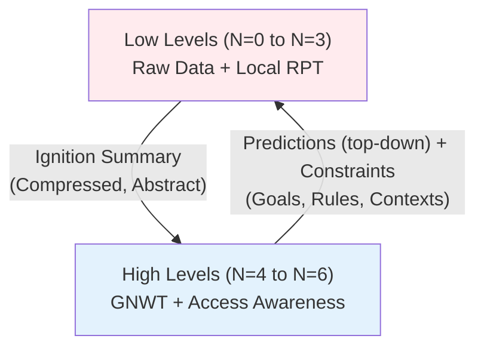
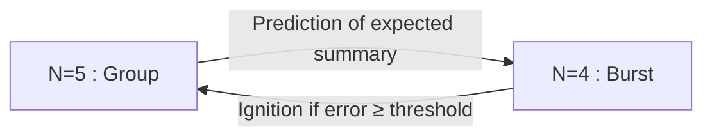
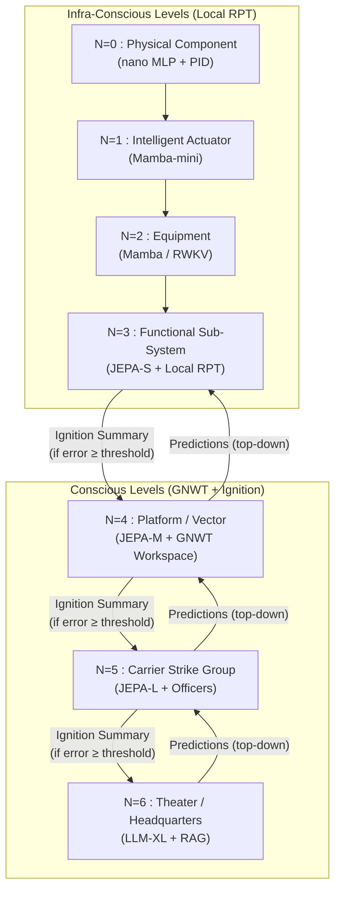
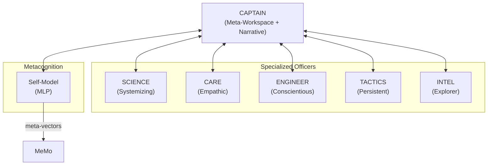
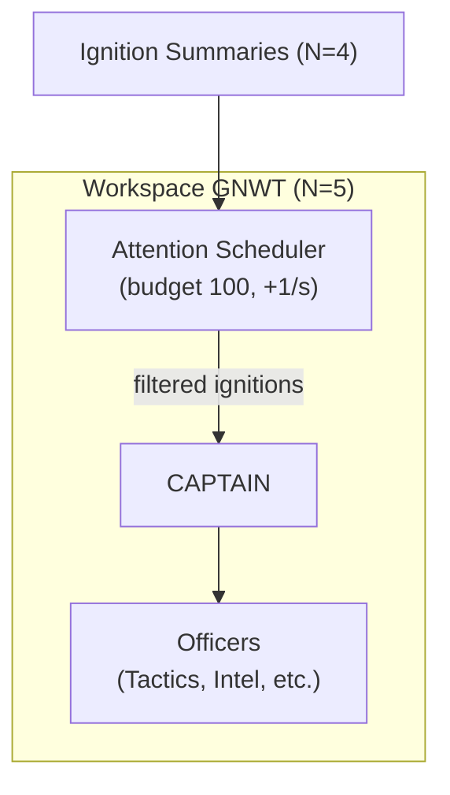
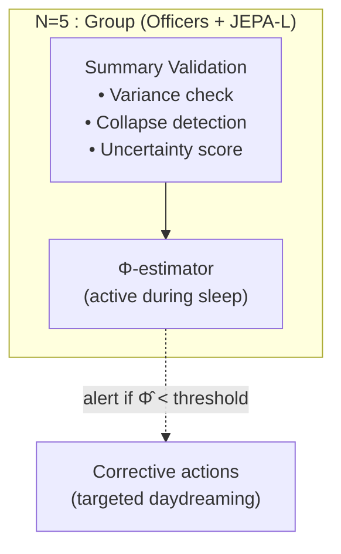
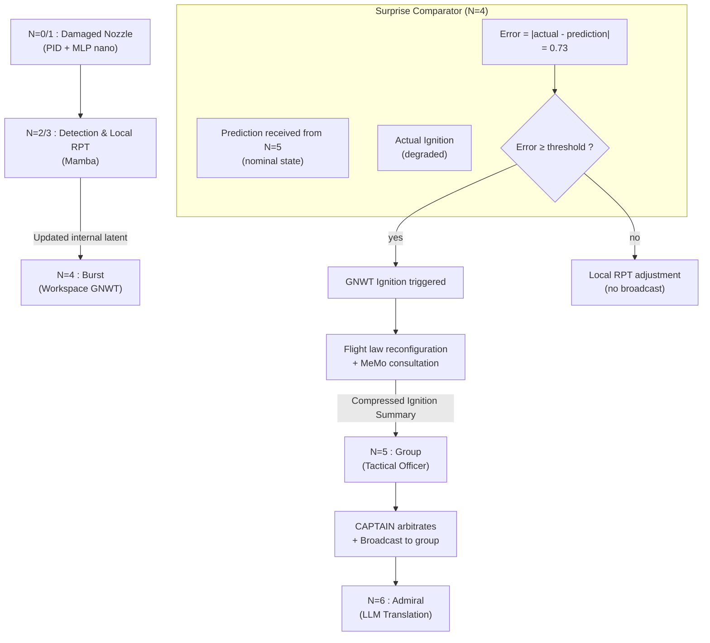
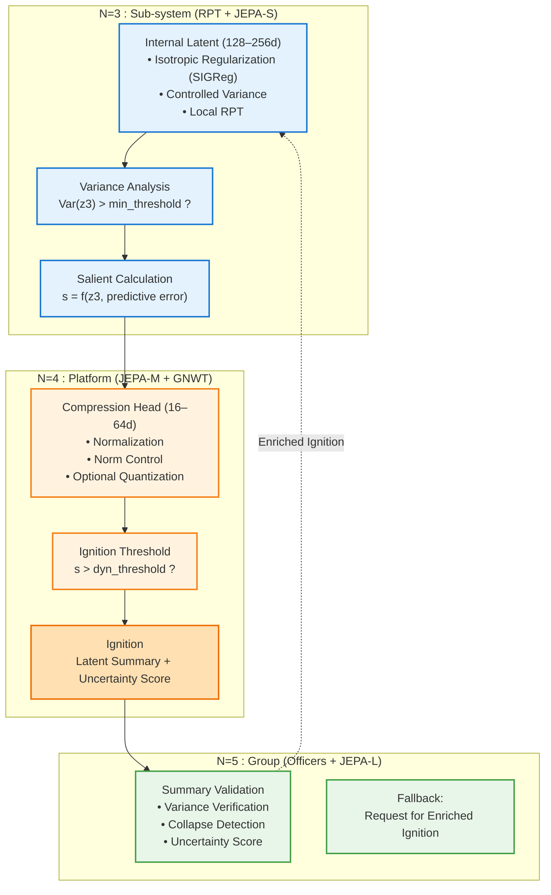

> ✨ Translated automatically with [**Do-My-Work**](https://github.com/AlainCo/do-my-work) — profile: technical.

# General Target Architecture: Example of GAN 2040



**Fundamental Principle:** Each vertical boundary is a **Markov Cover**. N+1 is blind to the internal states of N. The GNWT broadcast is *intra-level*; *inter-level* communication is only via compressed ignition summaries.

This stack describes the cognitive infrastructure of the Carrier Strike Group (CSG) in **2040**. Information flows from bottom to top in the form of **Compressed Ignition Summaries** (abstract latent vectors, no raw data), and from top to bottom in the form of **Predictions (top-down)** and not just simple **Contextual Priors** (constraints on the representation spaces of lower levels).
Downward flows are no longer simple constraints: they are **active predictions** generated by the JEPA of the higher level. The lower level compares its reality to this prediction; if the gap (surprise) exceeds an adaptive threshold (function of the attentional budget and the confidence of the Self-Model), a GNWT ignition is triggered. Below the threshold, the gap is absorbed by a local update of the latents (RPT). This mechanism implements hierarchical active inference, the foundation of functional access consciousness.

Each conscious level also integrates a Self-Model (metacognition), an Attention Scheduler (attention budget), and, during sleep, a Φ-estimator (causal integration) – see in the sections [Key Concepts and Theoretical Foundations](../concepts/concepts.md).





## Consciousness by Level: What to Expect

| Level | Inner Life (RPT) | Access Consciousness (GNWT) | Can "Report" |
|---|---|---|---|
| N=0-1 | No | No | No |
| N=2 | Minimal (hidden SSM state) | No | No |
| N=3 | Yes (local feedback loops) | No | To N=4 only |
| N=4-5 | Yes, rich | Yes (ignition + broadcast) | Yes, at its level |
| N=6 | Yes, narrative | Yes, strategic | Yes, human dialogue |

### The Bridge Officers (N=5): Socio-Cognitive Organization

Level N=5 is not a monolithic module but a **team of specialized instances** sharing a common workspace (the group workspace) via ignition summaries, without sharing their internal latent spaces.

Each conscious level (N≥4) includes a Self-Model (MLP) that generates a meta-vector for each ignition, ensuring metacognition and explainability.



Each level N≥4 is equipped with an Attention Scheduler that allocates a global attention budget. Ignitions consume tokens; if the budget is insufficient, they are deferred or inhibited. The scheduler dynamically adjusts the salience threshold to ensure reactivity in a saturated environment.
```



During the sleep phase, an estimator Φ̂ (proxy for causal integration) is periodically calculated from the stored ignition summaries. A drop in Φ̂ indicates a risk of functional disintegration and triggers corrective mechanisms (recalibration, enriched dreaming).
```



**Communication rule:** An officer only transmits to the shared workspace what has passed their personal ignition threshold. Like a team of seasoned professionals who know, respect, and trust each other — they don’t speak at every micro-event, they speak when it matters.

**Epistemic uncertainty score:** Each ignition summary carries a confidence score. An officer operating outside their area of expertise automatically penalizes their salience score. The captain integrates this signal in the arbitration — not to ignore, but to weigh.
```

### Failure Scenario in Combat:



**1. N=0/N=1:** A missile fragment damages the right nozzle. The PID enhanced by MLP nano instantly modifies the injection angles in **4 milliseconds** to prevent engine shutdown. No signal is sent back — it's handled locally, below the RPT threshold.

**2. N=2/N=3:** The engine's Mamba model detects a growing anomaly. Its local RPT loops run, attempt to consolidate an assessment. After stabilization, they generate a **Vector Ignition Summary**: *[propulsion_anomaly | severity=0.73 | type=thrust_asymmetry | workaround_available=true]*. No raw data dump — a compressed semantic vector.

**3. N=4 – Prediction vs. Reality Comparison**:
The Rafale receives a **prediction** of its expected state (e.g., `[nominal_state, thrust=1.0]`) from the higher level (N=5). In parallel, its local RPT loops produce an **actual ignition** `[degraded, asymmetry=0.73]`. The comparator calculates the error (0.73). Since this error exceeds the dynamic threshold (e.g., 0.5), a **GNWT ignition** is triggered. If the error had been below the threshold, the discrepancy would have been resolved locally (updating the RPT latent) without broadcasting.

**4. N=5/N=6:** The TACTICAL officer of the group picks up Leader-3's ignition first (it's within his field of salience). He proposes a reconfiguration of the frigate jamming scheme. The CAPTAIN arbitrates and broadcasts the decision to the group. The LLM N=6 translates for the admiral: *"Leader-3 maintains its mission with a 20% reduced evasion capability. Reorganization of the frigate jamming scheme to cover it. Mission window duration reduced to T+15min."* (N=5's prediction is updated via learning)

## 🔧 Structural Latent Constraints (Anti-Collapse)


Levels N=2 to N=5 exchange **compressed latent vectors** (internal RPT, predictive JEPA, Ignition Summaries). To ensure the stability of these flows in a hierarchical architecture, three structural constraints are imposed:



### 1. Regularized Internal Latents (RPT / JEPA)

Each module maintains a **bounded but non-degenerate** latent space.
Without constraints, predictive models (JEPA, SSMs) converge towards a **representation collapse**: all inputs mapped to the same vector.

To avoid this, internal latents are regularized via:

- **Gaussian isotropy** (LeJEPA, SIGReg)

- **Decorrelation** (VICReg / Barlow Twins)

- **Strict normalization** (LayerNorm)

- **Light Gaussian noise** to avoid dead dimensions

These mechanisms ensure that each dimension carries useful information and that predictions remain stable over time.

### 2. Hierarchy of Sizes: Internal > Ignition

To avoid cascading information loss:

- Internal RPT/JEPA latent: **128–256 dimensions**

- Ignition summary: **16–64 dimensions**

The Ignition summary is produced by a **dedicated compression head**, which applies:

- normalization

- optional quantization

- norm control (||z|| ≈ constant)

This ensures a stable statistical API between levels, even under degraded conditions.

### 3. Prevention of multi-level “double collapse”

In an architecture N=3→N=4→N=5, two successive compressions can lead to a **double collapse**:

- internal collapse of the JEPA/RPT

- collapse of the Ignition summary

To avoid this:

- each level checks the **variance per dimension** of the received latent

- a too-poor Ignition summary triggers an **uncertainty signal**

- the upper level can request an **enriched Ignition** (fallback)

This mechanism maintains the coherence of latent flows across Markov covers.

### 4. Practical implementation rules

- **Always regularize internal latents** (SIGReg or equivalent)

- **Always compress via a dedicated head** (no raw projection)

- **Monitor the "life" of the latent** (variance, correlation, norm)

- **Test the value of the latent** (prediction of simple observable variables)

- **Limit the depth of compression** (avoid N=3→N=4→N=5→N=6 without control)

These constraints ensure the stability of the GAN 2040 architecture in failure, combat, and distributed cooperation scenarios.

> ✨ Translated automatically with [**Do-My-Work**](https://github.com/AlainCo/do-my-work) — a tool designed to make projects speak globally.
