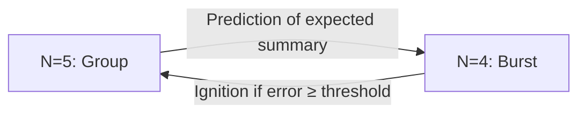
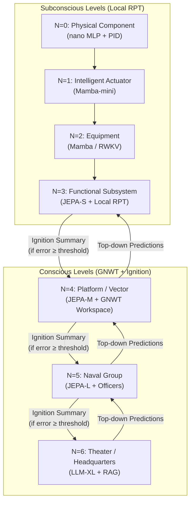
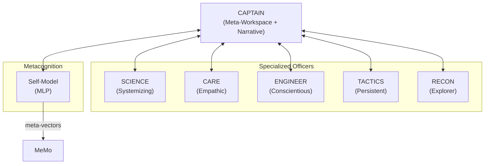
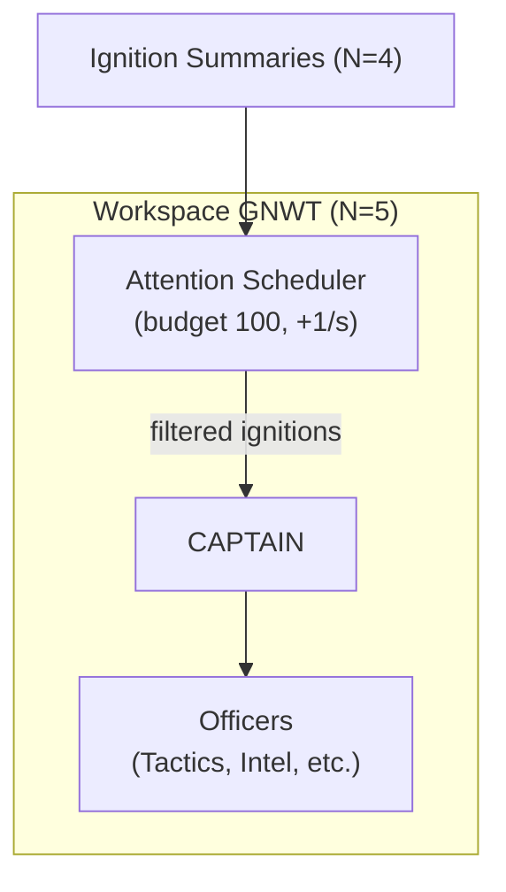
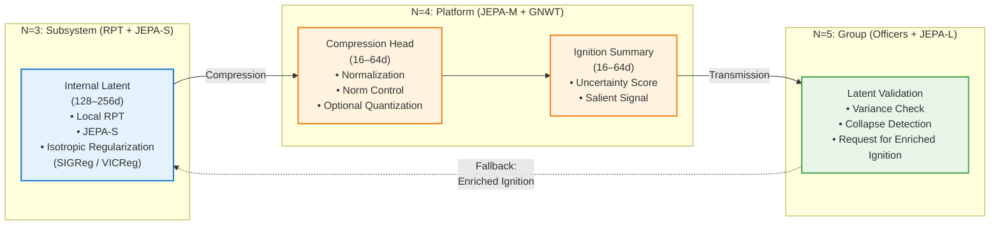
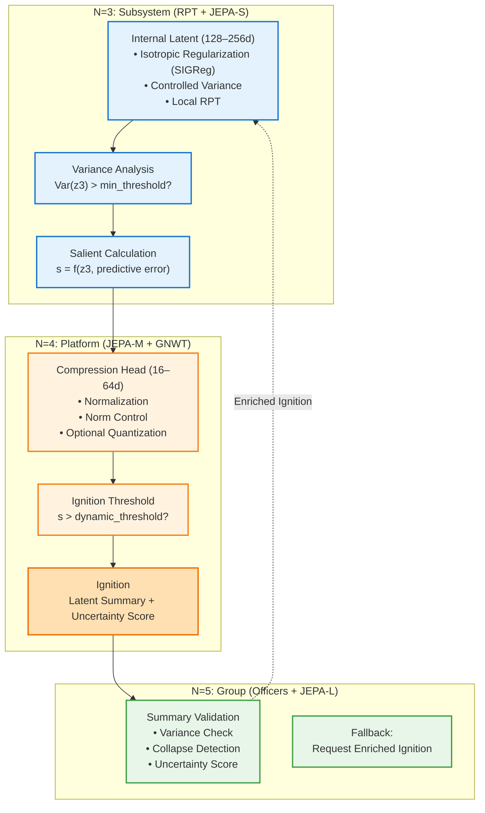

> ✨ Translated automatically with **Do-My-Work** — profile: technical.

# Target Architecture Overview: Example of the GAN 2040


**Core Principle:** Each vertical boundary is a **Markov Cover**. Level N+1 is blind to the internal states of N. The GNWT broadcast is *intra-level*; *inter-level* communication is solely via compressed ignition summaries.

This stack describes the cognitive infrastructure of the **Aéronaval Group (GAN)** in **2040**. Information flows upward in the form of **Compressed Ignition Summaries** (abstract latent vectors, no raw data), and downward as **Predictions (top-down)**, not just **Contextual Priors** (constraints on the representation spaces of lower levels).

Downward flows are no longer mere constraints: they are **active predictions** generated by the higher-level JEPA. The lower level compares its reality to this prediction; if the discrepancy (surprise) exceeds an adaptive threshold (a function of attentional budget and Self-Model confidence), a **GNWT ignition** is triggered. Below the threshold, the discrepancy is absorbed via local updates to the latents (RPT). This mechanism implements hierarchical active inference, the foundation of functional access consciousness.

Each conscious level also integrates a **Self-Model** (metacognition), an **Attention Scheduler** (attentional budget), and, during sleep, a **Φ-estimator** (causal integration) – see the sections [Key Concepts and Theoretical Foundations](../concepts/concepts.md).





## Consciousness by Level: What to Expect

| Level | Inner Life (RPT) | Access Consciousness (GNWT) | Can "Report" |
|---|---|---|---|
| N=0-1 | No | No | No |
| N=2 | Minimal (hidden SSM state) | No | No |
| N=3 | Yes (local feedback loops) | No | Only to N=4 |
| N=4-5 | Yes, rich | Yes (ignition + broadcast) | Yes, at its own level |
| N=6 | Yes, narrative | Yes, strategic | Yes, human dialogue |

### The Bridge Officers (N=5): Socio-Cognitive Organization

The N=5 level is not a monolithic module but a **team of specialized instances** sharing a common workspace (the group workspace) via ignition summaries, without sharing their internal latent spaces.

Each conscious level (N≥4) includes a Self-Model (MLP) that generates a meta-vector for each ignition, ensuring metacognition and explainability.



Each level N≥4 is equipped with an **Attention Scheduler** that allocates a global attentional budget. Ignitions consume tokens; if the budget is insufficient, they are deferred or inhibited. The scheduler dynamically adjusts the salience threshold to ensure reactivity in saturated environments.



During the sleep phase, an estimator **Φ̂** (a proxy for causal integration) is periodically computed from stored ignition summaries. A drop in **Φ̂** indicates a risk of functional disintegration and triggers corrective mechanisms (recalibration, enriched dreaming).

```mermaid
flowchart TD
    subgraph N5 ["N=5: Group (Officers + JEPA-L)"]
        V5["Summary Validation\n• Variance check\n• Collapse detection\n• Uncertainty score"]
        PHI["Φ-estimator\n(active during sleep)"]
    end

    V5 --> PHI
    PHI -.->|"alert if Φ̂ < threshold"| Actions["Corrective Actions\n(targeted dreaming)"]

**Communication Rule:** An officer only transmits to the shared workspace what has crossed their personal ignition threshold. Like a team of seasoned pros who know, trust, and respect each other — they don’t chatter about every minor event; they speak when it matters.

**Epistemic Uncertainty Score:** Each ignition summary carries a confidence score. An officer operating outside their domain of expertise automatically penalizes their salience score. The captain incorporates this signal into arbitration—not to dismiss it, but to weigh it.

### Combat Failure Scenario:
```


**1. N=0/N=1:** A missile fragment damages the right nozzle. The PID enhanced by MLP nano **instantly** adjusts the injection angles in **4 milliseconds** to prevent engine cutoff. No signal propagates upward—it’s handled locally, below the RPT threshold.

**2. N=2/N=3:** The engine’s Mamba model detects a growing anomaly. Its local RPT loops spin, attempting to consolidate an assessment. After stabilization, they generate a **vectorized Ignition Summary**: *[anomaly_propulsion | severity=0.73 | type=thrust_asymmetry | workaround_available=true]*. No raw data dump—just a compressed semantic vector.

**3. N=4 – Prediction vs. Reality Comparison:**

The Rafale receives a **prediction** of its expected state (e.g., `[nominal_state, thrust=1.0]`) from the higher level (N=5). Meanwhile, its local RPT loops generate a **real ignition** `[degraded, asymmetry=0.73]`. The comparator calculates the error (0.73). Since this error exceeds the dynamic threshold (e.g., 0.5), a **GNWT ignition** is triggered. If the error had been below the threshold, the discrepancy would have been absorbed locally (updating the RPT latent state) without broadcasting.

**4. N=5/N=6:** The **TACTICAL OFFICER** of the group detects Leader-3’s ignition first (it falls within their area of salience). They propose a reconfiguration of the frigate jamming pattern. The **CAPTAIN** arbitrates and broadcasts the decision to the group. The **LLM N=6** translates for the admiral: *"Leader-3 maintains its mission with a 20% reduced evasion capacity. Reorganization of the frigate jamming pattern to cover it. Mission window duration reduced to T+15min."* (N=5’s prediction is updated via learning)

## 🔧 **Latent Structural Constraints (Anti-Collapse)**



Levels N=2 to N=5 exchange **compressed latent vectors** (internal RPT, predictive JEPA, Ignition Summaries). To ensure the stability of these flows in a hierarchical architecture, three structural constraints are imposed:



### 1. Regularized Internal Latents (RPT / JEPA)

Each module maintains a latent space that is **bounded but non-degenerate**.
Without constraints, predictive models (JEPA, SSMs) converge toward **representation collapse**, where all inputs map to the same vector.

To prevent this, internal latents are regularized via:

- **Gaussian isotropy** (LeJEPA, SIGReg)

- **Decorrelation** (VICReg / Barlow Twins)

- **Strict normalization** (LayerNorm)

- **Light Gaussian noise** to avoid dead dimensions

These mechanisms ensure that each dimension carries useful information and that predictions remain stable over time.

### 2. Hierarchy of Sizes: Internal > Ignition

To prevent cascading information loss:

- Internal RPT/JEPA latent: **128–256 dimensions**

- Ignition summary: **16–64 dimensions**

The Ignition summary is produced by a **dedicated compression head**, which applies:

- normalization

- **Optional quantization**

- **Norm control** (||z|| ≈ constant)

This ensures a stable statistical API between levels, even under degraded conditions.

### 3. Preventing Multi-Level "Double Collapse"

In an architecture like N=3→N=4→N=5, successive compressions can lead to **double collapse**:

- Internal JEPA/RPT collapse

- Ignition summary collapse

To avoid this:

- Each level checks the **per-dimension variance** of the received latent

- A too-poor Ignition summary triggers an **uncertainty signal**

- The higher level may request an **enriched Ignition** (fallback)

This mechanism maintains latent flow consistency across Markov blankets.

### 4. Practical Implementation Rules

- **Always regularize internal latents** (SIGReg or equivalent)

- **Always compress via a dedicated head** (no raw projection)

- **Monitor the "life" of the latent** (variance, correlation, norm)

- **Test the latent value** (prediction of simple observable variables)

- **Limit compression depth** (avoid N=3→N=4→N=5→N=6 without control)

These constraints ensure the stability of the **GAN 2040** architecture in failure, combat, and distributed cooperation scenarios.

> ✨ Translated automatically with **Do-My-Work** — a tool designed to make projects speak globally.
