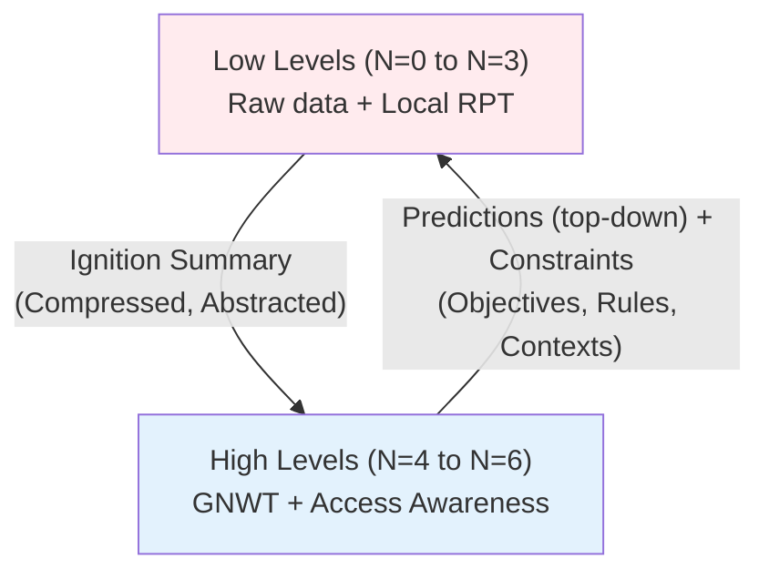
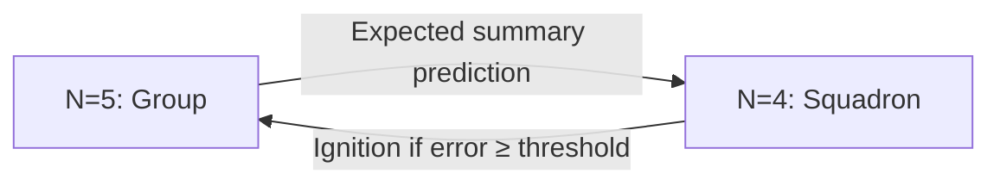
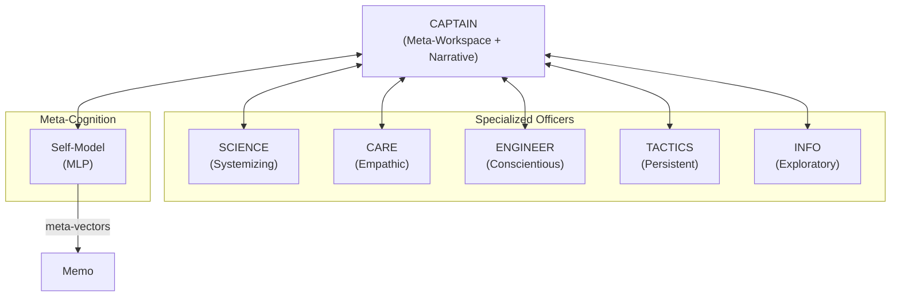
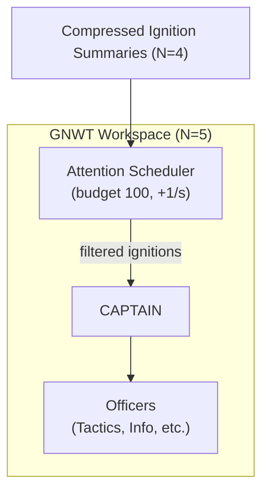
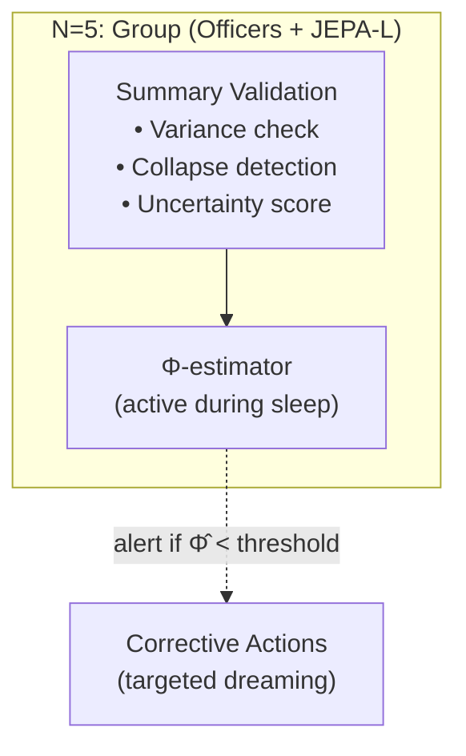
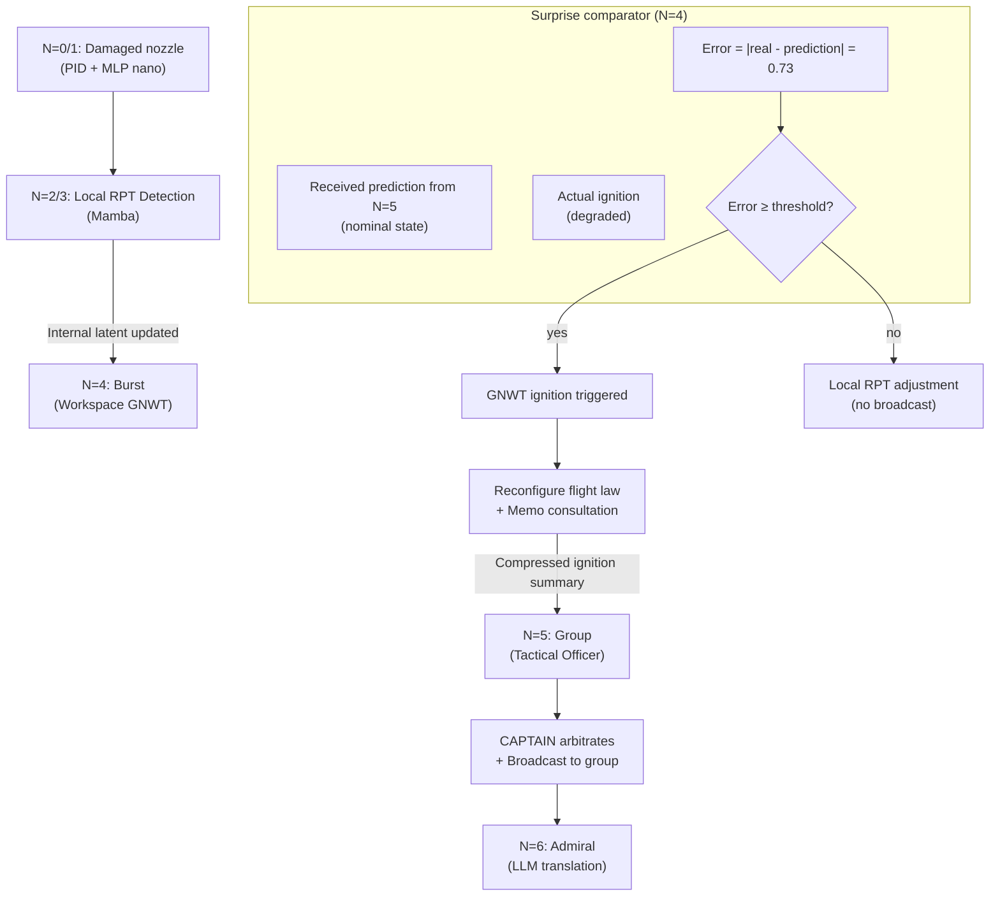
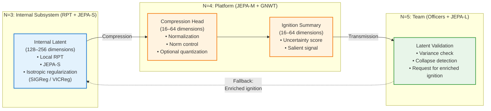

> ✨ Translated automatically with **Do-My-Work** — profile: technical.

# General Target Architecture: Example of the GAN 2040



**Fundamental Principle:** Each vertical boundary is a **Markov Coverage**. N+1 is blind to the internal states of N. The GNWT broadcast is *intra-level*; inter-level communication occurs only via compressed ignition summaries.

This stack describes the cognitive infrastructure of the Naval Aviation Group (GAN) in **2040**. Information flows upward as **Compressed Ignition Summaries** (abstract latent vectors, no raw data) and downward as **Predictive Top-Down Outputs**, not simple **Contextual Priors** (constraints on lower-level representation spaces). Descending flows are no longer mere constraints but **active predictions** generated by the upper-level’s JEPA. The lower level compares its reality to this prediction; if the gap (surprise) exceeds an adaptive threshold (function of attentional budget and self-model confidence), a GNWT ignition is triggered. Below the threshold, the gap is resolved by local latent updates (RPT). This mechanism performs hierarchical active inference, the foundation of functional access awareness.

Each conscious level integrates a **Self-Model** (metacognition), an **Attention Scheduler** (attentional budget), and, during sleep, a **Φ-estimator** (causal integration) — see [Key Concepts and Theoretical Foundations](../concepts/concepts.md).



```mermaid
flowchart TD
    subgraph Infra-Conscious Levels ["Infra-Conscious Levels (Local RPT)"]
        N0["N=0: Physical Component\n(MLP nano + PID)"] 
        N1["N=1: Intelligent Actuator\n(Mamba-mini)"]
        N2["N=2: Equipment\n(Mamba / RWKV)"]
        N3["N=3: Functional Subsystem\n(JEPA-S + Local RPT)"]
    end

    subgraph Conscious Levels ["Conscious Levels (GNWT + Ignition)"]
        N4["N=4: Platform/Vehicle\n(JEPA-M + GNWT Workspace)"]
        N5["N=5: Naval Group\n(JEPA-L + Officers)"]
        N6["N=6: Theater/Staff\n(LLM-XL + RAG)"]
    end

    N0 --> N1 --> N2 --> N3
    N3 -->|"Compression Ignition Summary\n(if error ≥ threshold)"| N4
    N4 -->|"Compression Ignition Summary\n(if error ≥ threshold)"| N5
    N5 -->|"Compression Ignition Summary\n(if error ≥ threshold)"| N6

    N6 -->|"Top-Down Predictions"| N5
    N5 -->|"Top-Down Predictions"| N4
    N4 -->|"Top-Down Predictions"| N3

## Level Awareness: What to Expect

| Level | Inner Life (RPT) | Access Consciousness (GNWT) | Can "Report" |
|---|---|---|---|
| N=0-1 | No | No | No |
| N=2 | Minimal (hidden SSM state) | No | No |
| N=3 | Yes (local feedback loops) | No | To N=4 only |
| N=4-5 | Yes, rich | Yes (ignition + broadcast) | Yes, at its own level |
| N=6 | Yes, narrative | Yes, strategic | Yes, human dialogue |

### Officers of the Bridge (N=5): Social-Cognitive Teamwork

Level N=5 is not a monolithic module but a **team of specialized instances** sharing a common workspace (the group workspace) via ignition summaries, without sharing their internal latent spaces.

Each conscious level (N≥4) includes a Self-Model (MLP) generating a meta-vector for each ignition, ensuring metacognition and explainability.
```



---



**Source Text Translation:**

During the sleep phase, a **Φ-estimator** (proxy for causal integration) is periodically calculated from ignition summaries stored. A drop in Φ̂ indicates a risk of functional disintegration and triggers corrective mechanisms (recalibration, enriched dreaming).



**Communication Rule:** An officer only transmits to the shared workspace what has passed its personal ignition threshold. Like a team of experienced professionals who know each other, respect each other, and know how to stand—**they don’t discuss every micro-event**; they speak only when it matters.

**Epistemic Uncertainty Score:** Each ignition summary carries a confidence score. An officer operating outside their expertise area automatically penalizes their salience score. The captain incorporates this signal into arbitration—not to ignore, but to weigh.

### Combat Failure Scenario:



---
**1. N=0/N=1:** A missile fragment hits the right nozzle. The PID, enhanced by MLP nano, instantly adjusts injection angles in **4 milliseconds** to prevent engine shutdown. No signal is sent up—handled locally below RPT threshold.

---
**2. N=2/N=3:**
The Mamba model of the engine records an increasing anomaly. Its local RPT loops run to consolidate an evaluation. After stabilization, they generate a **vectorized ignition summary**:
*[propulsion anomaly | severity=0.73 | type=asymmetry_thrust | workaround_available=true]*.
No raw data dump—only a semantically compressed vector.

---

**3. N=4 – Prediction vs. Reality Comparison:**
The Rafale receives from the higher level (N=5) a **predicted state** (e.g., `[nominal state, thrust=1.0]`). Concurrently, its local RPT loops produce a **real ignition** `[degraded, asymmetry=0.73]`. The comparator calculates the error (0.73). Since this error exceeds the dynamic threshold (e.g., 0.5), a **GNWT ignition** is triggered. If the error had been below the threshold, the discrepancy would have been locally resolved (updating the RPT latent) without broadcasting.

**4. N=5/N=6:** The **TACTICAL OFFICER** of the group first detects the ignition of **Leader-3** (within their domain of salience). They propose a **reconfiguration of the frigate jamming scheme**. The **CAPTAIN** arbitrates and broadcasts the decision to the group. The **N=6 LLM** translates for the admiral: *"Leader-3 maintains its mission with a reduced evasion capability of 20%. Reorganization of the frigate jamming scheme to cover it. The mission window duration is reduced to T+15 minutes."* (The prediction from N=5 is updated via learning.)



The levels N=2 to N=5 exchange **compressed latent vectors** (internal RPT, predictive JEPA, Ignition Summaries). To ensure stability of these flows in a hierarchical architecture, three structural constraints are enforced:


---

### **1. Regularized Internal Latents (RPT / JEPA)**
Each module maintains a **bounded yet non-degenerate latent space**.
Without constraints, predictive models (JEPA, SSMs) collapse into a **single-point representation** (all inputs mapped to one vector).

To prevent this, internal latents are regularized via:

- **Gaussian isotropy** (LeJEPA, SIGReg)

- **Decorrelation** (VICReg / Barlow Twins)

- **Strict normalization** (LayerNorm)

- **Light Gaussian noise** to avoid dead dimensions

These mechanisms ensure each dimension carries meaningful information and predictions remain stable over time.

---

### **2. Hierarchy of Dimensions: Internal > Ignition**
To avoid information loss in cascades:

- **Internal latent (RPT/JEPA):** **128–256 dimensions**
- **Ignition summary:** **16–64 dimensions**

The Ignition Summary is generated by a **dedicated compression head**, applying:

- normalization
- optional quantization
- norm control (||z|| ≈ constant)

This ensures a stable statistical API between levels, even under degraded conditions.

---

### **3. Prevention of Multi-Level "Double Collapse"**

In an architecture spanning **N=3 → N=4 → N=5**, successive compressions can lead to a **double collapse**:

- **internal collapse** of JEPA/RPT
- **collapse of the Ignition Summary**

To mitigate this:

- Each level checks the **dimensional variance** of the received latent vector.
- A **too sparse Ignition Summary** triggers an **uncertainty signal**.
- The higher level may request an **enriched Ignition** (fallback).

This mechanism preserves latent flow coherence across Markov covers.

---

### **4. Implementation Practical Rules**

- **Always regularize internal latents** (SIGReg or equivalent).
- **Always compress via a dedicated head** (avoid raw projection).
- **Monitor latent "lifespan"** (variance, correlation, norm).
- **Test latent value** (predictability of simple observable variables).
- **Limit compression depth** (avoid N=3 → N=4 → N=5 → N=6 without safeguards).

These constraints ensure **GAN 2040 stability** in failure, combat, and distributed cooperation scenarios.

> ✨ Translated automatically with **Do-My-Work** — a tool designed to make projects speak globally.
