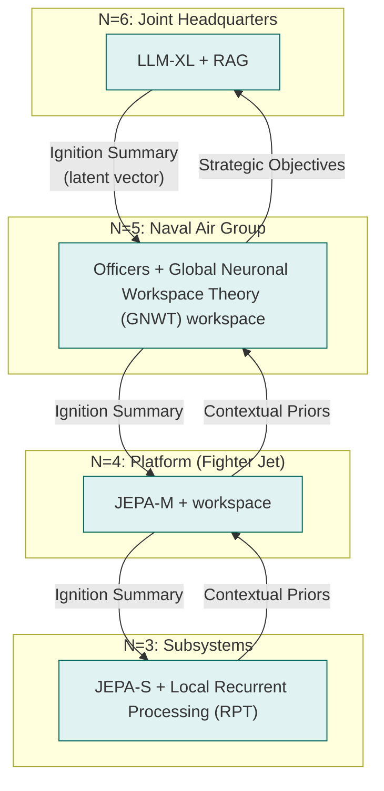
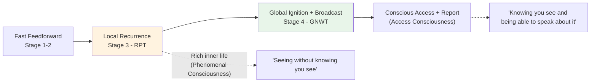
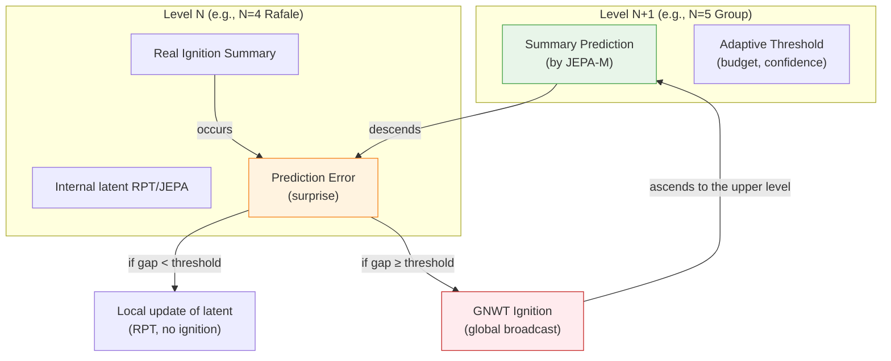
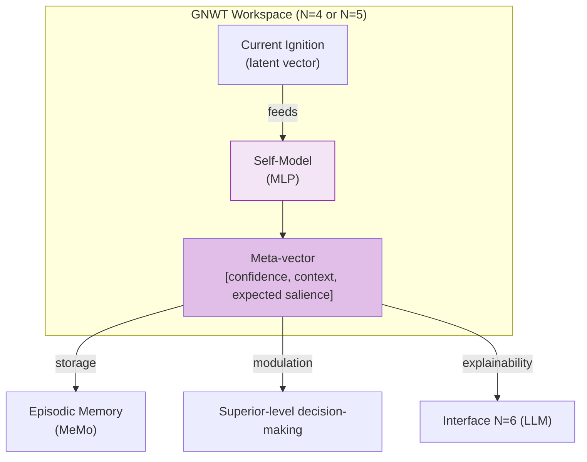
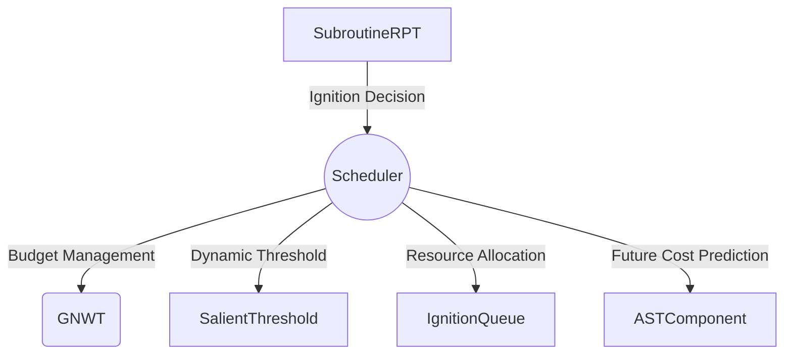
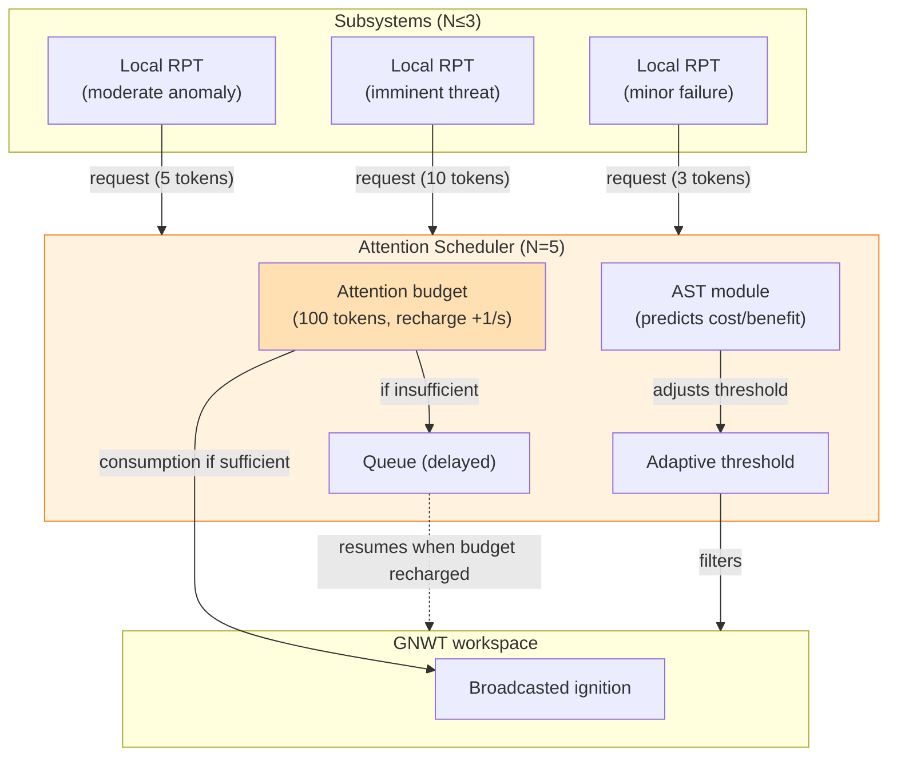
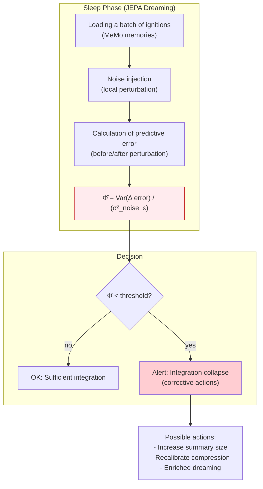

> ✨ Translated automatically with **Do-My-Work** — profile: technical.

# Key Concepts and Theoretical Foundations

To prove the viability of this architecture to our peers, every software engineering decision is based on major milestones in scientific literature on neuroscience, AI, and theoretical physics.

## A. Conditional Independence: Nested Markov Covers

**Theoretical Foundation:**
[Judea Pearl, *Probabilistic Reasoning in Intelligent Systems*, 1988](https://www.sciencedirect.com/book/monograph/9780080514895/probabilistic-reasoning-in-intelligent-systems) for Bayesian networks;
[Kirchhoff, Parr, Palacios, Friston, Kiverstein, *The Markov blankets of life: autonomy, active inference and the free energy principle* (2018)](https://royalsocietypublishing.org/doi/10.1098/rsif.2017.0792) for theoretical biology;
[Ciaunica, Levin, Rosas, Friston et al., *Nested Selves: Self-Organization and Shared Markov Blankets in Prenatal Development in Humans* (2023)](https://onlinelibrary.wiley.com/doi/10.1111/tops.12717) for generalization to collective systems.

**The Concept:** The Markov cover denotes the statistical membrane separating internal states ($I$) of a system from external states ($E$) of its environment. It consists of sensory (inputs) and active (outputs) states. The fundamental independence equation is:

$$P(I \mid B, E) = P(I \mid B)$$

**What recent literature adds:** A collective of active inference agents, if it maintains a Markov cover at the group level, can constitute a higher-level agent with its own generative model. This property is *scale-free*: it applies from the cell to the organism, and from the effector to the naval aircraft carrier group. Structures nest like Russian dolls.

**Technical Justification:** This is the principle of **anti-fusion of identity**. The higher level ($N+1$) never processes raw data from $N$—only its statistical API (the *ignition summary*). This ensures strict modularity of the component up to the fleet level and preserves the identity of each level as a distinct cognitive entity. A conscious Rafale is perceived by the group as an opaque external object—just as you perceive your liver as "working well" without accessing hepatocytes.



---

### **B. Two-Stage Consciousness: GNWT + RPT as facets of the same mechanism**

**Fondement Théorique :** [Bernard Baars, *A Cognitive Theory of Consciousness*, 1988](https://philpapers.org/rec/BAAACT) et [Stanislas Dehaene, *A Neuronal Model of a Global Workspace in Effortful Cognitive Tasks*, 2006](https://nyaspubs.onlinelibrary.wiley.com/doi/abs/10.1111/j.1749-6632.2001.tb05714.x) for the **Global Neuronal Workspace Theory (GNWT)**; [Victor Lamme, *Towards a true neural stance on consciousness*, 2006](https://www.cell.com/trends/cognitive-sciences/abstract/S1364-6613(06)00237-3); works by the **COGITATE consortium** and particularly [Storm et al., *An integrative, multiscale view on neural theories of consciousness*, Neuron, 2024](https://www.sciencedirect.com/science/article/pii/S0896627324000886).

**Concept:** Traditionally seen as rival theories, GNWT and RPT actually describe **two complementary temporal and functional phases** of a unified conscious processing mechanism, as highlighted by Storm et al. in their multiscale synthesis:

---
**Translation Hints:**
- "Global Neuronal Workspace Theory" → **GNWT** (abbreviation preferred in scientific context).
- "Rétroaction locale" → **recurrent processing** (RPT).
- "Phenomenal consciousness" → **phenomenal consciousness** (PC).
- "Access consciousness" → **access consciousness** (AC).



The **RPT** captures each module’s **rich inner life** through local feedback loops (recurrent processing). It explains **phenomenal consciousness (PC)**—raw subjective experience, even unreportable. The **GNWT** describes what happens when a consolidated signal crosses a salience threshold and spreads globally across the workspace, enabling **access consciousness (AC)**: integration, reporting, decision-making, and voluntary control.

**Critical architectural consequence:** In our hierarchy, the RPT→GNWT threshold occurs naturally at the boundary **N=3 → N=4**. Below this: continuous RPT processing (inner life of subsystems, without global broadcast). From N=4 onward: central workspace, ignitions, and the ability to "report" a compressed summary upward.

This separation is not arbitrary—it reflects both computational constraints (broadcast cost) and biological mechanisms identified by recent literature, as Storm et al. note: theories do not oppose but operate at complementary scales: local (RPT) and global (GNWT).

**Technical Justification:** An aircraft reactor (N=2-3) resolves micro-issues via local RPT loops (e.g., Mamba). If damage exceeds its capacity, it generates a **vectorized Ignition Summary** upward. The Rafale (N=4) captures this signal in its GNWT workspace, reconfigured flight laws, and only relays an abstract summary to the group—preserving Markov covers while enabling functional access consciousness at each relevant level.

---

### **Hierarchical Active Inference & Predictive Processing (JEPA + Predictive Processing)**

#### **Theoretical Foundations**
- **Joint Embedding Predictive Architecture (JEPA)**:
  [LeCun, *A Path Towards Autonomous Machine Intelligence* (2022)](https://www.semanticscholar.org/paper/A-Path-Towards-Autonomous-Machine-Intelligence-LeCun-Courant/775f42ed458b8c5b0f2094ea4ff5b64c557b1a34)
  Predicts abstract latent representations of the world rather than raw observations, filtering out noise and learning causal structures.

- **Predictive Processing (PP)** : [Clark, *Whatever Next? Predictive Brains, Situated Agents, and the Future of Cognitive Science* (2013)] – the brain is a prediction machine that continuously minimizes prediction error. Consciousness arises when this error cannot be resolved locally.

- **Active inference** : [Friston, *The Free-Energy Principle: A Unified Brain Theory* (2010)] – an agent minimizes its free energy by acting on the world to make its predictions true.

- **Predictive hierarchies** : higher levels generate predictions (priors) that constrain the representations of lower levels; residual prediction error ascends.

### Concept

Your architecture already uses **JEPA** as a latent prediction engine and **descending contextual priors**. Hierarchical active inference unifies and strengthens these two flows:

- **Descending predictions (top-down)** : each level N+1 generates a **prediction** of the ignition summary that level N should produce. This prediction is learned by the JEPA of the higher level (encoder and predictor).

- **Ascending prediction error (bottom-up)** : Level N compares the received prediction with its actual ignition (or internal latent state). The **surprise**—the error signal—ascends.

- **GNWT ignition threshold** : Ignition (global broadcast) occurs only when the surprise exceeds an **adaptive threshold** (depending on attention budget, context, history). Below this threshold, the error is locally resolved via latent updates (RPT).

- **Free-energy minimization** : The entire system learns to reduce the sum of prediction errors across all levels, refining its world models (JEPA) and selecting actions that make the world more predictable.

In this framework, **contextual priors** are no longer static, unidirectional vectors. They are **active predictions**: the higher level *anticipates* what the lower level should observe, and the lower level *adjusts* its representations to align with these predictions—or ascends an error if the gap is too large.

### Adaptative Threshold:
Defined by `seuil = f(budget_attentionnel, confidence_Self_Model)`.
High attention budget + high self-confidence → high threshold (few ignitions).
Low budget + low confidence → low threshold (maximum reactivity).
This threshold is learned during the sleep phase via free-energy minimization.

---

### Technical Justification:

- **Theoretical Unification:** JEPA becomes the concrete implementation of prediction within an active inference hierarchy. The benefits of JEPA (latent prediction, noise robustness) are retained while benefiting from active inference formalism (free energy, permanent downward causality).

- **Solves the downward causality issue (discussed in §3.5):** Descending predictions continuously constrain perceptual spaces, and ignition occurs only when prediction fails.

- **Improves stability and learning:** Prediction error serves as a dense learning signal during the sleep phase. The system can "dream" by generating its own predictions and minimizing error on simulated trajectories.

- **Adaptive ignition threshold:** Attention rarity (budget) and confidence (self-model) can modulate the threshold, making the system less verbose under nominal conditions and more reactive in surprise situations.

---
### Diagram:
*(No labels to translate)*



---

**Example: Revisited Catapult Anomaly**

---
**Normal Situation**: JEPA-M of Rafale (N=4) predicts its next ignition summary as `[nominal_state, thrust=1.0]`. The upper level (N=5) sends this prediction. Rafale compares it with its real ignition (same). Error is negligible → no ignition. System operates silently, conserving resources.

**Anomaly**: Turbine is damaged. Rafale generates a real ignition `[degraded, asymmetry=0.73]`. The nominal downward prediction causes a major error. If this error exceeds the adaptive threshold (e.g., 0.5), a **GNWT ignition** is triggered. This ascends to the upper level and updates predictions for future cycles (learning).

**Learning**: During sleep phase, the system replays this sequence. JEPA learns to predict the degraded ignition from the anomaly context. Next time a similar asymmetry appears, the downward prediction will be `[degraded, asymmetry≈0.7]`, error remains low, and no ignition is needed—unless the anomaly worsens.
---

**Normal operating condition**: The JEPA-M of the Rafale (N=4) predicts its next ignition summary will be `[nominal_state, thrust=1.0]`. The higher level (N=5) sends this prediction. The Rafale compares it with its actual ignition (identical). The error is negligible → no ignition. The system operates silently, conserving resources.

**Anomaly**: The nozzle is damaged. The Rafale generates an actual ignition `[degraded, asymmetry=0.73]`. The nominal downward prediction produces a significant error. Since the error exceeds the adaptive threshold (e.g., 0.5), a **GNWT ignition** is triggered. This sends feedback to the higher level and updates the prediction for future cycles (learning).

**Learning**: During the sleep phase, the system replays this sequence. JEPA learns to predict the degraded ignition from the anomaly context. The next time a similar asymmetry appears, the downward prediction will be `[degraded, asymmetry≈0.7]`, keeping the error low and requiring no ignition—unless the anomaly worsens.

---

**D. Lightweight Architectures for Real-Time: SSMs (Mamba, RWKV, xLSTM)**

**Key Theoretical Foundations:**
- [Gu & Dao, *Mamba: Linear-Time Sequence Modeling with Selective State Spaces* (2023)](https://arxiv.org/abs/2312.00752)
- [Peng et al., *RWKV: Reinventing RNNs for the Transformer Era* (2023)](https://arxiv.org/abs/2305.13048)
- [Beck et al., *xLSTM: Extended Long Short-Term Memory* (2024)](https://arxiv.org/abs/2405.04517)

**Concept:** *State Space Models* (SSMs) offer an alternative to Transformers for low-level layers (N=0 to N=3), with key advantages for embedded systems:

| Architecture       | Key Advantage                          | Target Use in SoS                     |
|--------------------|----------------------------------------|---------------------------------------|
| **MLP nano + PID** | µs latency, deterministic, FPGA         | N=0: Physical control loop             |
| **Mamba-mini**     | Linear in sequence length, low RAM      | N=1: Intelligent actuators             |
| **Mamba / RWKV**   | 5× throughput vs Transformer, continuous | N=2-3: Subsystems, perception          |
| **JEPA-S**         | Latent prediction, local RPT            | N=3: Emergence of inner life           |
| **JEPA-M/L + GNWT**| Workspace, ignition, broadcast          | N=4-5: Platform awareness              |
| **JEPA-XL + LLM**  | Narrative, strategic, multimodal       | N=5-6: Command, admiral dialogue       |

**Theoretical Foundations:**

[Gu & Dao, *Mamba: Linear-Time Sequence Modeling with Selective State Spaces* (2023)](https://arxiv.org/abs/2312.00752);
[Peng et al., *RWKV: Reinventing RNNs for the Transformer Era* (2023)](https://arxiv.org/abs/2305.13048);
[Beck et al., *xLSTM: Extended Long Short-Term Memory* (2024)](https://arxiv.org/abs/2405.04517).

**Concept:** *State Space Models* (SSMs) provide an alternative to Transformers for low-level layers (N=0 to N=3), offering key advantages for embedded systems:

| Architecture          | Key Advantage                          | Target Use in SoS                     |
|-----------------------|----------------------------------------|---------------------------------------|
| **MLP nano + PID**    | Microseconds, deterministic, FPGA       | N=0: Physical control loop             |
| **Mamba-mini**        | Linear in sequence length, low RAM      | N=1: Intelligent actuators             |
| **Mamba / RWKV**      | 5× throughput vs Transformer, continuous | N=2-3: Subsystems, perception          |
| **JEPA-S**            | Latent prediction, local RPT            | N=3: Emergence of inner life           |
| **JEPA-M/L + GNWT**   | Workspace, ignition, broadcast          | N=4-5: Platform awareness              |
| **JEPA-XL + LLM**     | Narrative, strategic, multimodal       | N=5-6: Command, admiral dialogue       |

**Computational Psychopathology and Functional Profiles:** Mamba provides smoother and physically plausible control signals compared to Transformers, which can introduce discontinuities. This is precisely what is needed for layers N=1 to N=3: a seamless, continuous, and reactive processing without the quadratic cost of attention.

**Fondement Théorique :**
[Friston, *Computational psychiatry: from synapses to sentience* (2022)](https://www.nature.com/articles/s41380-022-01743-z);
[Teufel & Fletcher, *The promises and pitfalls of applying computational models to neurological and psychiatric disorders* (2016)](https://academic.oup.com/brain/article/139/10/2600/2196698);
[Nettle, *Personality: What makes you the way you are* (2023)](https://www.researchgate.net/publication/375324828_Personality_What_Makes_You_The_Way_You_Are) for the evolutionary Big Five model;
[Baron-Cohen, *Autism: the empathizing-systemizing (E-S) theory* (2009)](https://pubmed.ncbi.nlm.nih.gov/19338503/);
[Bakiaj et al., *Unmasking the Dark Triad: A Data Fusion Machine Learning Approach to Characterize the Neural Bases of Narcissistic, Machiavellian, and Psychopathic Traits* (2025)](https://onlinelibrary.wiley.com/doi/10.1111/ejn.16674).

**Concept:** Personality traits are modeled as **hyperparameter adjustments** in error-probability processing. These are not "modes" you *switch on*, but structural biases in salience functions and ignition thresholds.

**Officer profiles and their neuroscience foundations:**

| Role          | Dominant Trait          | Mechanism                                                                 | Preferred Ignition Domain                     |
|---------------|-------------------------|---------------------------------------------------------------------------|-----------------------------------------------|
| **Science / Analysis** | Openness + TSA-Systemizing | Strong local connectivity, weak long-range connectivity                  | Anomalies, logical incoherences, weak signals |
| **Care / Crew**   | High agreeableness, active insula/ACC | Oxytocin, empathy circuits                                                 | Human internal states, ethics, cohesion       |
| **Engineer**     | Very high conscientiousness | Strong PFC, inhibitory control, low impulsivity                          | System failures, drift, execution quality     |
| **Tactical**     | Persistent + Moderate Dark Triad | Memory of failures, low fear processing                                   | Threats, vulnerabilities, action windows      |
| **Intelligence** | Openness + Low agreeableness | Exploratory dopamine, incoherence detection                              | Adversarial patterns, deception, info asymmetry |
| **Captain**     | Extraversion + Situational Neuroticism | DA reward, PFC flexibility, mission narrative arbitrage                   | Crises, opportunities, global mission narrative |

**Anti-fusion by profile:** Each officer’s latent spaces are **non-overlapping**. They exchange only *ignition summaries* via the command channel. Each officer’s episodic memory is their identity—what is preserved, like in craniophagic twins maintaining distinct wills despite partially shared circuits.

**Curiosity-Driven Exploration and Game-Based Learning**

**Theoretical Foundation:**
[Jürgen Schmidhuber, *Formal Theory of Creativity, Fun, and Intrinsic Motivation* (1990–2010)](https://www.researchgate.net/publication/224155374_Formal_Theory_of_Creativity_Fun_and_Intrinsic_Motivation_1990-2010);
[Oudeyer & Kaplan, *What is Intrinsic Motivation? A Typology of Computational Approaches* (2007)](https://doi.org/10.3389/neuro.12.006.2007);
[Oudeyer, *Intrinsic Motivation Systems for Autonomous Learning* (2007)](https://web-archive.southampton.ac.uk/cogprints.org/5473/index.html).

**Concept:** Curiosity is an **intrinsic reward function** driven by information gain (reduction of predictive entropy). The agent is rewarded when it explores regions where its world model remains imprecise—neither too simple (boring) nor too chaotic (unintelligible). The optimal learning zone is where **learning progress** is maximized.

**The training protocol via gameplay:** Off-operation phases are structured as *wargames* with variable rules. The system plays against itself (MCTS variant in the latent space **JEPA**), against parametric simulated opponents, and against past versions of itself. Each gaming session generates *surprise vectors* feeding into the **Reverie phase** (see Learning Cycle, §3.C).

**Technical justification:** This avoids system brittleness in *Out of Distribution* situations. A system trained solely on real mission data would fail in untrained scenarios. Gameplay generates diverse experiences at low cost.

---

**G. Continuous Episodic Memory (MeMo / Continuous Online Training)**

**Theoretical Foundations:**
[Quek et al., *MeMo: Memory as a Model* (2026)](https://arxiv.org/abs/2605.15156); [Kirkpatrick et al., *Overcoming Catastrophic Forgetting* (2017)](https://arxiv.org/abs/1612.00796); [Walker, *The Role of Sleep in Cognition and Emotion* (2017)](https://pubmed.ncbi.nlm.nih.gov/19338508/).

**Concept:** Episodic memory is not just a logbook but a **continuous stream of compressed latent vectors** capturing only salient ignition moments. Each significant event becomes a **rich episodic memory**: a JEPA latent state + contextual metadata.

**Concrete example: Catapult Anomaly**

```mermaid
flowchart TD
    subgraph Mission ["Real-Time Mission Phase"]
        A["T=14h23\nIgnition N=4 (Rafale)"] 
        B["Catapult anomaly detected\nsalient = 0.87"]
        C["Capture MeMo\n→ Episodic vector"]
    end

    Mission -->|"Transferring black boxes"| Sleep

    subgraph Sleep ["Phase 2: Sleep & Dreaming"]
        D["Generative Replay JEPA\n(variation simulations)"]
        E["Recalibrate ignition thresholds\n(PISTE module)"
        F["Consolidation\n→ Long-term Memory (RAG)"]
    end

    Sleep -->|"Update + Consolidation"| Consultation

    subgraph Consultation ["Phase 3: Subsequent Consultation\n(T+30 days)"]
        G["New similar anomaly detected"]
        H["Episodic RAG retrieves\nmemory T=14h23"]
        I["Proactive proposal\n→ Workaround 'catapulte_B'"]
    end

    classDef ignition fill:#fff3e0,stroke:#f57f17,stroke-width:2px
    classDef replay fill:#f3e5f5,stroke:#8e24aa
    class A,B,G ignition
    class D replay
```

**Details of stored episodic vector:**

```
Ignition_ID: 2026-05-24_1423_Leader3
Module: PISTE_N4
Salient: 0.87
Latent JEPA state: [0.42, -0.17, 0.91, ..., 0.63]
Tags: [anomaly_catapult, asymmetry_thrust, degradation]
Outcome: mission_abort=false
Workaround: catapulte_B
Context: wind_25kt, wet_bridge, formation_lead
```

**Justification Technique:** This is the key difference between a system that *performs* and one that **truly learns** from experience. The continuous episodic memory MeMo also serves as the foundation for the **durable identity** of each module or officer—its personal biography of ignitions forms its "computational self," preserved even after weight updates.

**MeMo Mechanism:**

- **Mission:** Stream captures of ignitions (N=3 → N=6)

- **Reverie:** Generative replay in the latent JEPA space

- **Debriefing:** Consolidation and sedimentation into long-term memory (episodic RAG)

This mechanism enables continuous learning without *catastrophic forgetting* while preserving each entity’s unique identity within the SoS.

---

### **H. Latent Space Stability: Size, Collapse, and Structural Constraints**

#### **The Problem: A Latent Space Must Be Bounded… but Not Empty**
In the architectures described above—**local RPT**, **predictive JEPA**, **GNWT ignition summaries**—the core principle is:

The system encodes the world into a **compact latent space**, exchanged between levels via Markov covers.

Yet, a bounded latent space presents a classic dilemma:

- **Too small** → loss of information, poor predictions, unusable ignition signals.
- **Too large** → the model "cheats," encodes noise, or worse:
**collapses** (all inputs → same vector).

This phenomenon is well-documented in JEPA and modern SSL methods: without structural constraints, the model converges toward a trivial solution that minimizes loss without learning meaningful structure.

#### **Current Solutions: Constraining Latent Distributions**

##### **1. Historical Heuristics (BYOL, SimSiam, DINO)**
Early generations of self-supervised models avoided collapse via ad-hoc mechanisms:

- **Stop-gradient** (BYOL, SimSiam)
- **Teacher–student EMA** (MoCo, DINO)
- **Asymmetric augmentations**
- **Forced normalization** (BatchNorm, LayerNorm)
- **Decorrelation** (VICReg, Barlow Twins)

These methods work but remain fragile and require fine-tuned hyperparameter tuning.

##### **2. Theoretical Breakthrough: Isotropic Gaussian Distribution (LeJEPA, SIGReg)**
Recent work by Zhang et al. (2024) proposes a principled approach:

> **A useful latent space must follow an isotropic Gaussian distribution.**

**Why?**
Because an isotropic latent space:

- uses **all dimensions**,
- avoids dead or crushed directions,
- remains **well-conditioned** for prediction,
- prevents collapse naturally.

To enforce this, LeJEPA introduces **SIGReg** (*Sketched Isotropic Gaussian Regularization*):

- Projects latents onto many random directions,
- Forces each projection to follow **N(0,1)**,
- By the Cramér–Wold theorem, the multivariate distribution becomes isotropic.

**Effect:**
A **full, bounded, stable** latent space—**no stop-gradient or special architecture** required.

##### **3. LeWM: Minimalist Stable JEPA World Model**
LeWM (2024) applies this principle to a **minimalist JEPA world model**:

- **Encoder → latent** →

Dans les architectures présentées précédemment—**RPT local**, **JEPA prédictive**, **résumés d’Ignition GNWT**—everything relies on a shared principle:

the system encodes the world in a **compact latent space**, exchanged between levels via Markov covers.

However, a bounded latent space presents a classic dilemma:

- **Too small** → loss of information, poor predictions, unusable Ignition signals.

- **Too large** → the model "cheats," encodes noise, or worse:
**collapses** (all inputs → same vector).

This phenomenon is well-documented in JEPA and modern SSL methods: without structural constraints, the model converges toward a trivial solution that minimizes loss without learning useful structure.

#### Current Solutions: Constraining the Latent Distribution

##### 1. Historical Heuristics (BYOL, SimSiam, DINO)

Early generations of self-supervised models avoided collapse via ad-hoc mechanisms:

- **Stop-gradient** (BYOL, SimSiam)

- **Teacher–student EMA** (MoCo, DINO)

- **Asymmetric augmentations**

- **Forced normalization** (BatchNorm, LayerNorm)

- **Decorrelation** (VICReg, Barlow Twins)

These methods work, but remain fragile and require fine-tuning of hyperparameters.

##### 2. The Theoretical Shift: Isotropic Gaussian Distribution (LeJEPA, SIGReg)

Recent works by Zhang et al. (2024) propose a more principled approach:

> **A useful latent space must follow an isotropic Gaussian distribution.**

Why?
Because an isotropic latent space:

- utilizes **all dimensions**,
- avoids dead or collapsed directions,
- remains **well-conditioned** for prediction,
- prevents **collapse naturally**.

To enforce this property, LeJEPA introduces **SIGReg** (*Sketched Isotropic Gaussian Regularization*):

- projects latents onto many random directions,
- forces each projection to follow **N(0,1)**,
- by the Cramér–Wold theorem, the multivariate distribution becomes isotropic.

**Effect:**
a **full**, **bounded**, **stable** latent space, **without stop-gradient or special architecture**.

##### 3. LeWM: Minimal and Stable JEPA World Model

LeWM (2024) applies this principle to a **JEPA world model**:

- encoder → latent space,
- predictor → future latent space,
- only two losses:
**prediction** (MSE),
**isotropy** (SIGReg).

Résultat :
---

Un model predictive compact, stable, and usable for **latent dreaming** (generative replay).

#### Application to Our Architecture: RPT, JEPA, and Ignition Summaries

In our hierarchy, three latent spaces coexist:

- **Internal RPT latent (N=2–3)**
recurrent loop for local encoding
captures the "inner life" of the module
must be compact yet expressive

- **Predictive JEPA latent (N=3–4)**
abstract world model
must be stable for prediction and dreaming

- **GNWT Ignition Summary (N=3→4→5)**
short vector exchanged between levels
statistical API between Markov covers

All three face the same risk:
**internal collapse + excessive compression = loss of critical information.**

Using isotropic regularization (e.g., LeJEPA) allows:

- preventing collapse in internal latents,
- ensuring each dimension carries information,
- stabilizing inter-level exchanges,
- making Ignition summaries more reliable and comparable.

#### Current Challenges and Open Questions

Despite these advances, several challenges remain:

- **Optimal latent dimension**: no analytical formula exists.
- **Multi-level propagation**: how to ensure isotropy persists across Markov covers?

---

- **Ignition compression**: risk of "double collapse" if internal latent is already poor.
- **Ethical/legal constraints**: how to encode them in a regularized latent space?
- **JEPA dreaming**: still computationally expensive, even with latent spaces.

These points form **essential experimental validation axes** for the project’s continuation.

---

## I. Self-Modelling and Metacognition: The Self-Schema (Higher-Order Thought)

### Theoretical Foundation

- **Higher-Order Thought (HOT)** – Rosenthal (2005): a mental state becomes conscious when accompanied by a higher-order thought about it.
- **Self-Model Theory of Subjectivity** – [Metzinger (2003)](https://mitpress.mit.edu/9780262528193/being-no-one/) – phenomenal self is a real-time model the brain constructs of itself.
- **Metacognition in AI**: confidence models, performance prediction, decision calibration.
- **Recent applications**: [Bahrami et al., *Metacognitive reinforcement learning* (2024)](https://arxiv.org/abs/2401.08099) – self-evaluation improves adaptation.

### Concept

In your architecture, every conscious module (N≥4) has a **Self-Model**: a lightweight network (MLP or light transformer) attached to its GNWT workspace.
At each ignition, the Self-Model generates a **meta-vector** encoding:

- a **confidence score** (derived from local prediction error),
- an **ignition context** (type of anomaly, origin),
- an **expected salience** for the next level.

This meta-vector is then:

- stored in episodic memory (MeMo) alongside the memory,
- used to modulate decisions at the next level (e.g., Captain Officer weighs ignitions by confidence),
- sent to the human interface (N=6) for explainability.

The Self-Model is trained **during sleep phase**: it predicts the real salience that occurred after each past ignition, or predicts the error of a neighboring module. Thus, it learns to understand the system’s strengths and weaknesses—a form of **computational metacognition**.

- **Ignition Compression**: risk of "double collapse" if the internal latent space is already impoverished.

- **Ethical/legal constraints**: how to encode these within a regularized latent space?

- **JEPA Dreaming**: still computationally expensive, even in latent form.

These points form the **key experimental validation axes** for the project’s continuation.

## I. Self-Modelling and Metacognition: The Self-Schema (Higher-Order Thought)

### Theoretical Foundation

- **Higher-Order Thought (HOT)**: Rosenthal (2005) – a mental state becomes conscious when accompanied by a thought of a higher order about it.

- **Self-Model Theory of Subjectivity**: [Metzinger (2003)](https://mitpress.mit.edu/9780262528193/being-no-one/) – the phenomenal self is a real-time model that the brain constructs of itself.

- **Metacognition in AI**: confidence models, performance prediction, decision calibration.

- **Recent Applications**: [Bahrami et al., *Metacognitive reinforcement learning* (2024)](https://arxiv.org/abs/2401.08099) – self-assessment improves adaptation.

### Concept

Dans votre architecture, chaque module conscient (N ≥ 4) possède un **Self-Model**: a lightweight neural network (MLP or light transformer) attached to its GNWT workspace.

At each ignition, the Self-Model generates a **meta-vector** that encodes:

- a **confidence score** derived from the local prediction error,
- the **context of ignition** (type of anomaly, origin),
- an **expected salience** for the higher level.

This meta-vector is then:

- stored in episodic memory (MeMo) alongside the memory,
- used to modulate decisions at the higher level (e.g., the Captain Officer weighs ignitions based on their confidence),
- sent to the human interface (N=6) for explainability.

The Self-Model is trained **during the sleep phase**: it is asked to predict the actual salience that occurred after each past ignition or to predict the error of a neighboring module. Thus, it learns to understand the system’s strengths and weaknesses—a form of **computational metacognition**.

### Technical Justification

- Addresses a major gap identified in the discussion (§3.3): the absence of agentive self-modeling.

- Allows the system to signal its own biases (e.g., *"I am the Tactical Officer; my confidence is low for this scenario"*).

- Enhances robustness: if the Self-Model detects a generalized confidence drop, it can trigger a **targeted dream** for retraining.

- Makes the architecture more explainable for human operators (N=6 can query the Self-Model via the LLM).

---

### Diagram



---

### Concrete Example: Catapult Anomaly (from MeMo example)
During the *Catapult Anomaly* ignition (salience: 0.87), the Rafale’s (N=4) Self-Model generates a meta-vector:

This vector is stored alongside the episodic memory. Later, if a similar anomaly occurs, the Self-Model is consulted: high confidence allows reusing the workaround without waiting for superior-level validation. Conversely, if confidence were low (e.g., 0.35), the system would require human confirmation.

During the ignition of *Anomaly catapulse* (expected salience: 0.87), the Rafale’s (N=4) Self-Model generates a meta-vector:

```
confidence: 0.82
context: "asymmetry_thrust, workaround_catapulse_B"
expected salience: 0.85
```

This vector is stored alongside the episodic memory. Later, if a similar anomaly occurs, the Self-Model’s high confidence allows reusing the workaround without waiting for superior-level validation. Conversely, if confidence were low (e.g., 0.35), human confirmation would be required.

---

### **J. Competitive Attention and Budget: The Attention Schema Theory (AST) Framework**

#### **Theoretical Foundations**
- **Attention Schema Theory (AST)** (Graziano & Webb, 2015): The brain constructs a simplified model of its own attention process, called the *attention schema*, enabling it to regulate and predict focus dynamics.
- **Attention as a Limited Resource** (Kahneman, 1973): Attention is a scarce, shareable resource with a replenishing budget over time.
- **Cognitive Inhibition** (Aron, 2011): Inhibitory control prevents overload and conflict resolution.

- **Application in AI**: attention models with computational cost, *sparse attention*, *budgeted attention* (Clark et al., 2022).

### The Concept

Your architecture features a **global workspace (GNWT)** where ignitions are broadcasted. Without limits, the system risks **attention inflation**: too many simultaneous ignitions would saturate the workspace, degrade decision quality, and blur prioritization.

To prevent this, each conscious level (N≥4) is equipped with an **Attention Scheduler** managing a **global attention budget** (e.g., 100 "attention tokens").
**How it works**:

- Each ignition consumes a certain number of tokens (e.g., 5 tokens for a normal ignition, 10 for a critical one).
- The budget refills linearly over time (e.g., +1 token per second).
- If the budget is insufficient, the ignition is **delayed** (queued) or **inhibited** (lost).

- The **salient threshold** required to trigger an ignition can be dynamically adjusted by the scheduler based on load. When the budget is low, only the most salient ignitions pass.

- The **Attention Scheduler** does not decide *what* to ignite—this is handled by the RPT modules—but it **allocates resources** and can **prioritize** between concurrent ignitions. It relies on an AST component that models the budget state and predicts future costs.

### Technical Justification

- Addresses a major gap in current architecture (section 3.2 of the discussion): the absence of an inhibitory mechanism. Without a budget, the system risks a *narrative drift* and loss of reactivity.

- Simulates metabolic constraints (a biological brain cannot process everything simultaneously).

- Facilitates arbitration between officers: the Captain does not need to compare all ignitions; the scheduler has already filtered them.

- Enhances robustness in combat: during stress (low budget), only immediate threats pass—non-critical ignitions are deferred.

### Diagram




### Concrete Example: High-Intensity Combat

During an engagement phase, the Group’s (N=5) attention budget drops to 15 tokens (recharge +1/s). The Tactical Officer receives three simultaneous ignitions:

---
**Ignition A** (missile threat, salience 0.95, cost 10 tokens) – accepted, budget → 5 tokens.
**Ignition B** (secondary radar anomaly, salience 0.60, cost 5 tokens) – rejected due to budget, queued.
**Ignition C** (engine failure of scout drone, salience 0.70, cost 5 tokens) – also rejected.

The scheduler prioritizes the imminent threat. When the budget recovers (after 5 seconds), the radar anomaly is processed—but if a new threat arises in the meantime, it takes priority. This mechanism prevents saturation and ensures critical decisions aren’t drowned in noise.

---
## K. Causal Integration: Thermometer Φ (Artificial Dream Phase)

### Theoretical Foundation

- **Integrated Information Theory (IIT)** (Tononi, 2004, 2015): Consciousness is defined as a system’s ability to integrate information, measured by Φ (phi). A system with high Φ has a unified experience.

- **Perturbational Complexity Index (PCI)** (Massimini et al., 2005, 2009): Experimental measure of causal integration in humans (TMS + EEG). PCI distinguishes conscious from unconscious states.

- **Application to artificial systems**: Causal integration measurements in neural networks (Barrett & Seth, 2011; Luppi et al., 2022).

- **Ignition A** (missile threat, salience 0.95, cost 10 tokens) – accepted, budget → 5 tokens.

- **Ignition B** (secondary radar anomaly, salience 0.60, cost 5 tokens) – rejected due to insufficient budget, queued.

- **Ignition C** (engine failure of scout drone, salience 0.70, cost 5 tokens) – also rejected.

The scheduler prioritizes the imminent threat. When the budget recovers (after 5 seconds), the radar anomaly is processed—but if a new threat arises in between, it takes priority again. This mechanism prevents overload and ensures critical decisions aren’t drowned in noise.

## **K. Causal Integration: Thermometer Φ (Sleep Phase)**

### **Theoretical Foundation**
- **Integrated Information Theory (IIT)** – Tononi (2004, 2015): Consciousness is defined by a system’s ability to integrate information, measured by Φ (phi). A system with high Φ has a unified experience.
- **Perturbational Complexity Index (PCI)** – Massimini et al. (2005, 2009): Experimental measure of causal integration in humans (TMS + EEG). PCI distinguishes conscious from unconscious states.

- **Application to artificial systems**: causal integration measurements in neural networks (Barrett & Seth, 2011; Luppi et al., 2022).

### The Concept

Your architecture already exchanges **ignition summaries** between levels via Markov covers and includes anti-collapse mechanisms to prevent latent degeneration. However, it does not measure whether the information conveyed by these summaries is **causally integrated**—that is, whether a local perturbation propagates significantly across the hierarchy.

During the **sleep phase** (artificial dreaming), a **Φ-estimator** module is activated at level N=5 (or N=6). Its operation:

- **Selection** of a sample of past ignitions (from MeMo).

- **Perturbation**: injection of controlled Gaussian noise into certain ignition summaries (or internal latents)—simulating a micro-information lesion.

- **Measurement** of the variation in predictive error of the JEPA model (or active inference surprise) between the original trajectory and the perturbed trajectory.

- **Calculation of a Φ̂ proxy** (simplified formula):
  `Φ̂ = Var(Δ predictive error) / (σ²_noise + ε)`
  – the greater the variation, the more integrated the system is (a small perturbation significantly alters the global dynamics).

- **Alert threshold**: if Φ̂ falls below a critical value (experimentally calibrated), the system detects a *collapse of integration*: ignitions have become too independent, and the hierarchy is disintegrating.

This mechanism is **non-invasive** (implemented in latent simulation) and **periodic** (e.g., at the end of each sleep cycle). It does not modify real-time decisions but alerts operators or triggers corrective actions: recalibration of compression, increase in the dimension of ignition summaries, or targeted dreaming to reintegrate.

### Technical Justification

- **Diagnostic tool rather than permanent component**: IIT is difficult to compute in real-time; offline, it is feasible and useful.

- **Enrich the variance metrics** (anti-collapse) with a **causal measurement**: two systems can have the same latent variance, but vastly different integrations.

- **Predict silent drifts**: before performance declines, Φ̂ can gradually decrease, signaling a fragility of functional consciousness.

- **Consistent with literature**: recent studies (Luppi et al., 2022) show Φ̂ correlates with the performance of deep networks on integration tasks.

---

### Diagram



---

### Concrete Example: Officer Drift

The N=5 (Group) level has several officers (Tactics, Intelligence, etc.). After multiple combat cycles, the Intelligence officer starts ignoring weak signals from N=4 because their ignition thresholds increased in an uncoordinated manner.

During the next sleep phase, the Φ-estimator randomly perturbs some ignition summaries from the Intelligence memory. The global predictive error variation is abnormally low: a local perturbation makes almost no difference to group dynamics. Φ̂ drops below the threshold.

The alert triggers a **targeted dream**: the system replays scenarios where Intelligence must collaborate with Tactics, forcing shared ignitions. Thresholds are recalibrated. By the end, Φ̂ rises. The group regains coherence.

> ✨ Translated automatically with **Do-My-Work** — a tool designed to make projects speak globally.
