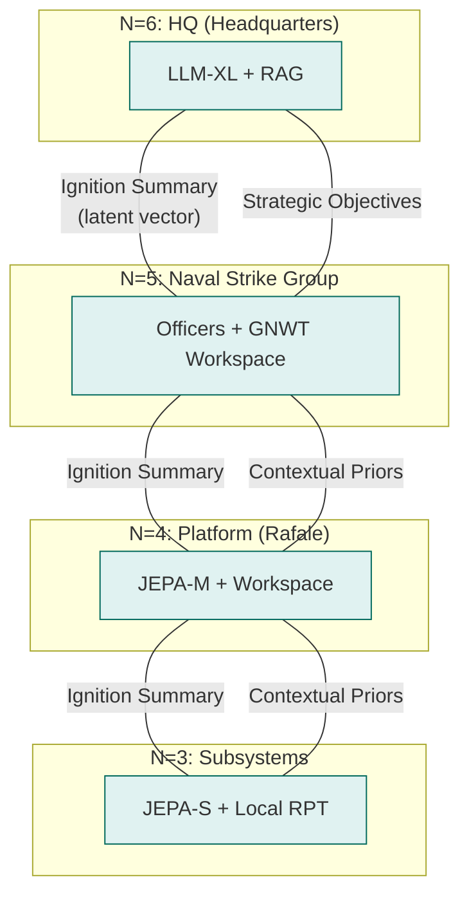
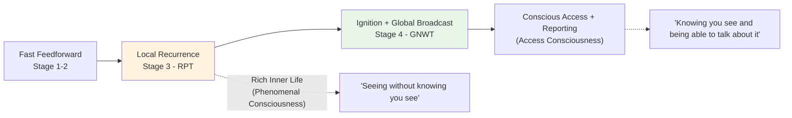
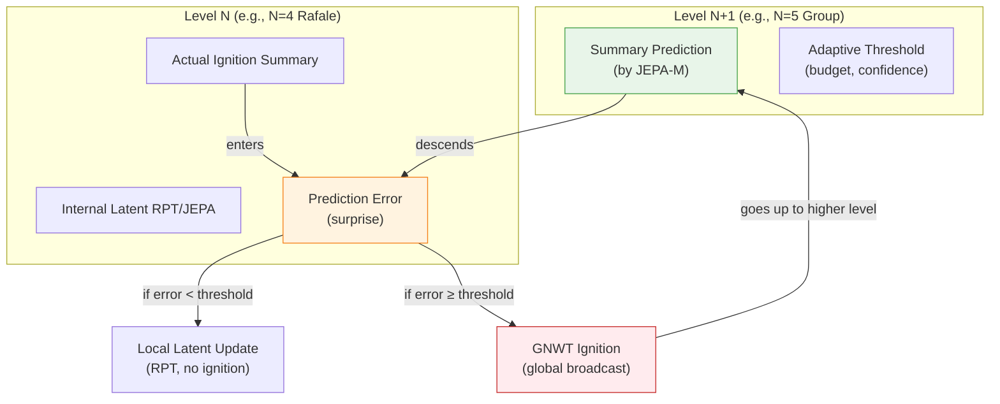
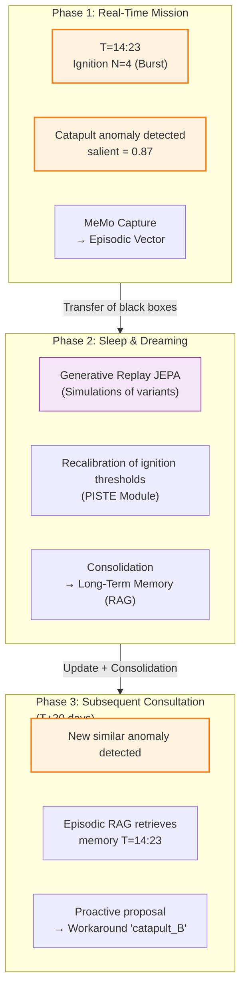
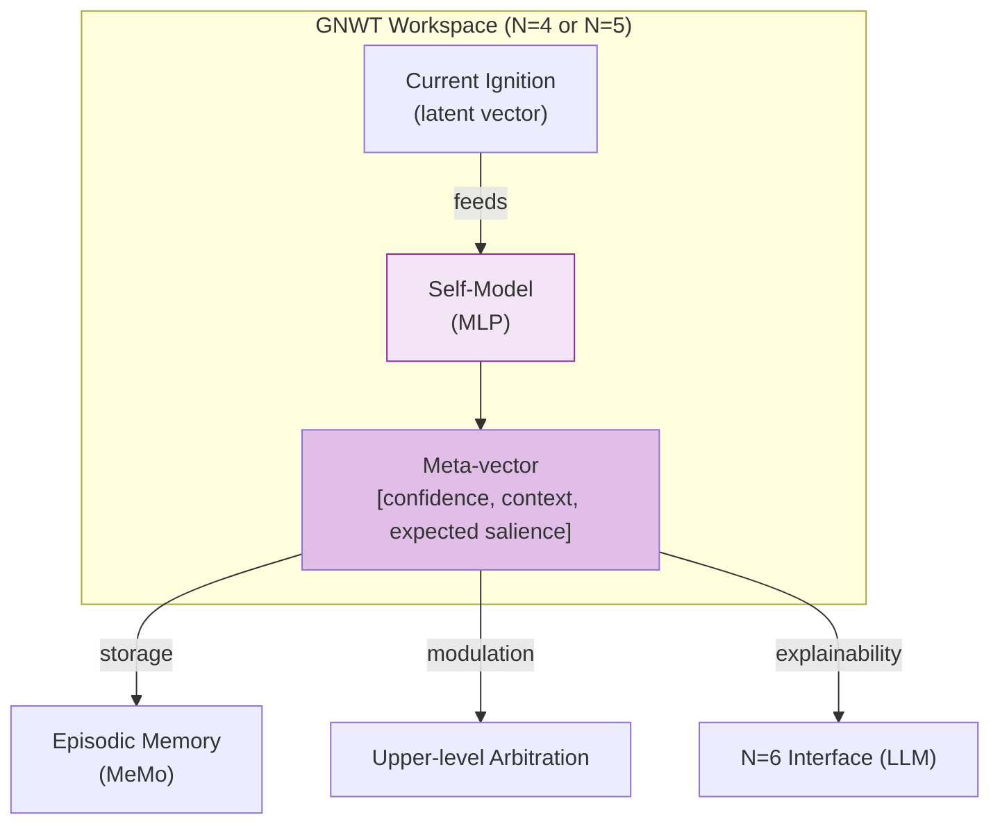
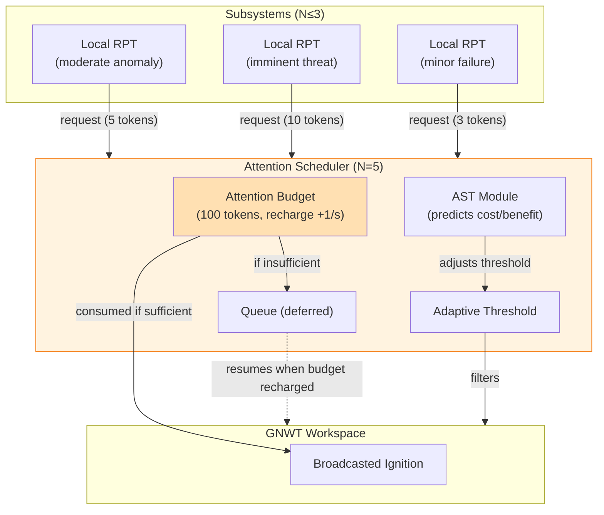
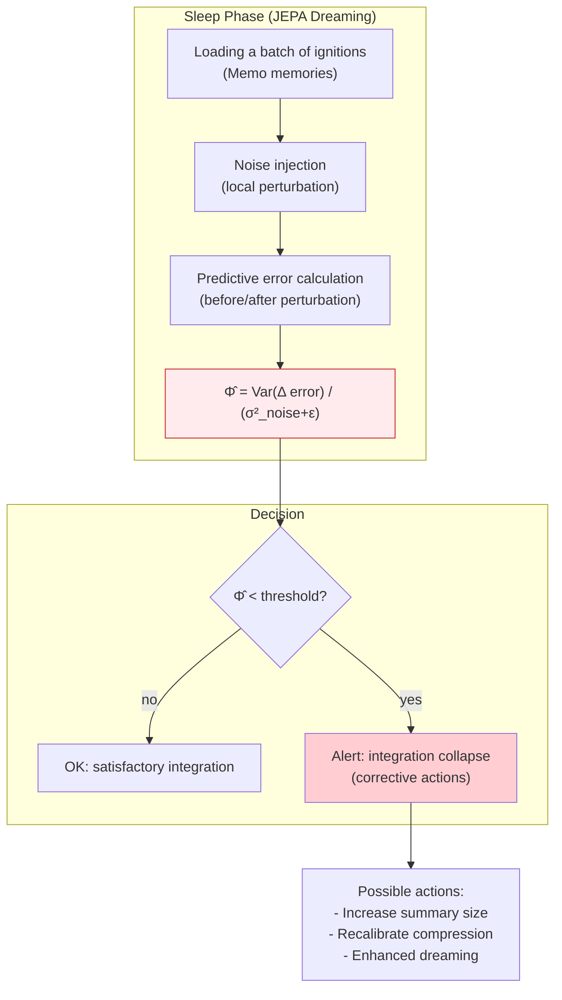

> ✨ Translated automatically with **Do-My-Work** — profile: technical.

# Key Concepts and Theoretical Foundations

To demonstrate the feasibility of this architecture to our peers, every software engineering decision is grounded in major milestones from the scientific literature in neuroscience, AI, and theoretical physics.

## A. Conditional Independence: Nested Markov Blankets

**Theoretical Foundation:**

[Judea Pearl, *Probabilistic Reasoning in Intelligent Systems*, 1988](https://www.sciencedirect.com/book/monograph/9780080514895/probabilistic-reasoning-in-intelligent-systems) for Bayesian networks;
[Kirchhoff, Parr, Palacios, Friston, Kiverstein, *The Markov blankets of life: autonomy, active inference and the free energy principle* (2018)](https://royalsocietypublishing.org/doi/10.1098/rsif.2017.0792) for theoretical biology;
[Ciaunica, Levin, Rosas, Friston et al., *Nested Selves: Self-Organization and Shared Markov Blankets in Prenatal Development in Humans* (2023)](https://onlinelibrary.wiley.com/doi/10.1111/tops.12717) for generalization to collective systems.

**The Concept:** Markov blanket refers to the statistical membrane separating a system's internal states ($I$) from its external states ($E$) in the environment. It consists of sensory (input) and active (output) states. The fundamental independence equation is written as:

$$P(I \mid B, E) = P(I \mid B)$$

**What Recent Literature Adds:** A collective of active inference agents can, if it maintains a Markov blanket at the group level, form a higher-level agent with its own generative model. This property is *scale-free*: it applies from the cell to the organism, and from the effector to the carrier fleet. The structures nest like Russian dolls.

**Technical Justification:** This is the principle of **identity anti-merging**. The higher level ($N+1$) never processes the raw data from $N$—only its statistical API (the *ignition summary*). This ensures strict modularity of the component up to the entire fleet, and preserves the identity of each level as a distinct cognitive entity. A conscious Rafale is perceived by the group as an opaque external object—just as you perceive your liver as "working fine" without accessing hepatocytes.



### B. Two-Tiered Consciousness: GNWT + RPT as Facets of the Same Mechanism
```

**Theoretical Foundation:** [Bernard Baars, *A Cognitive Theory of Consciousness*, 1988](https://philpapers.org/rec/BAAACT) and [Stanislas Dehaene (*A Neuronal Model of a Global Workspace in Effortful Cognitive Tasks*, 2006)](https://nyaspubs.onlinelibrary.wiley.com/doi/abs/10.1111/j.1749-6632.2001.tb05714.x) for the **Global Neuronal Workspace Theory (GNWT)**; [Victor Lamme, *Towards a true neural stance on consciousness*, 2006](https://www.cell.com/trends/cognitive-sciences/abstract/S1364-6613(06)00237-3); work by the [COGITATE consortium](https://www.arc-cogitate.com/project), and especially [Storm et al., *An integrative, multiscale view on neural theories of consciousness*, Neuron, 2024](https://www.sciencedirect.com/science/article/pii/S0896627324000886).

**The Concept:** Long considered as competitors, GNWT and RPT actually describe **two complementary temporal and functional phases** of the same conscious processing process, as emphasized by Storm et al. in their multiscale synthesis:



The **RPT** accounts for the **rich inner life** of each module through local feedback loops (recurrent processing). It explains **phenomenal consciousness (PC)**—raw subjective experience, even if not reportable. The **GNWT** describes what happens when a consolidated signal crosses a salience threshold and propagates widely across the global workspace, enabling **access consciousness (AC)**: integration, reporting, arbitration, and voluntary control.

**Critical architectural consequence:** In our hierarchy, the RPT→GNWT threshold naturally lies at the boundary **N=3 → N=4**. Below this: continuous local processing in RPT (inner life of subsystems, without global broadcast). From N=4 onward: central workspace, ignitions, and the ability to "report" a compressed summary upward.

This separation is not arbitrary—it reflects both computational constraints (cost of broadcasting) and biological mechanisms identified by recent literature. As noted by Storm et al., theories do not oppose each other but operate at complementary scales: local (RPT) and global (GNWT).

**Technical Justification:** An aircraft reactor (N=2-3) resolves micro-failures through local RPT loops (Mamba). If the damage exceeds its capacity, it generates a **Vectorial Ignition Summary** upward. The Rafale (N=4) captures this signal in its GNWT workspace, reconfigures its flight law, and only reports an abstract summary to the group—thus preserving Markov covers while enabling functional access consciousness at each relevant level.

## C. Hierarchical Active Inference Models of the World (JEPA + Predictive Processing)

### Theoretical Foundation

- **Joint Embedding Predictive Architecture (JEPA)** : [LeCun, *A Path Towards Autonomous Machine Intelligence* (2022)](https://www.semanticscholar.org/paper/A-Path-Towards-Autonomous-Machine-Intelligence-LeCun-Courant/775f42ed458b8c5b0f2094ea4ff5b64c557b1a34) – predicts abstract (latent) representations of the world rather than raw observations. It ignores irrelevant noise and promotes learning causal structures.

- **Predictive Processing (PP)** : [Clark, *Whatever next? Predictive brains, situated agents, and the future of cognitive science* (2013)](https://doi.org/10.1098/rstb.2013.0176) – the brain is a prediction machine that continuously minimizes prediction error. Consciousness arises when this error cannot be locally resolved.

- **Active inference**: [Friston, *The free-energy principle: a unified brain theory* (2010)](https://doi.org/10.1038/nrn2787) – an agent minimizes free energy by acting on the world to make its predictions true.

- **Predictive hierarchies**: higher levels generate predictions (priors) that constrain the representations of lower levels; residual error propagates upward.

### The concept

Your architecture already uses **JEPA** as a latent prediction engine and **descending contextual priors**. Hierarchical active inference unifies and strengthens these two flows:

- **Top-down predictions**: each level *N+1* generates a **prediction** of the ignition summary that level *N* should produce. This prediction is learned by the JEPA of the higher level (encoder and predictor).

- **Bottom-up prediction error**: At level N, the received prediction is compared with its actual ignition (or internal latent state). The discrepancy – the **surprise** – acts as an error signal that propagates upward.

- **GNWT ignition threshold**: The ignition (global broadcast) only occurs when the surprise exceeds an **adaptive threshold** (dependent on the attentional budget, context, and history). Below this threshold, the error is locally absorbed through updates to the latents (RPT).

- **Free energy minimization**: The entire system learns to reduce the sum of prediction errors across all levels, refining its world models (JEPA) and selecting actions that make the world more predictable.

In this framework, **contextual priors** are no longer fixed vectors unidirectionally sent. They are **active predictions**: the higher level *anticipates* what the lower level should observe, and the lower level *adjusts* its representations to match these predictions—or raises an error if the discrepancy is too large.

> **Adaptive threshold**: defined by `seuil = f(budget_attentionnel, confiance_Self_Model)`.
> High budget + high confidence → high threshold (fewer activations).
> Low budget + low confidence → low threshold (maximal reactivity).
> This threshold is learned during the sleep phase via **free-energy minimization**.

### Technical justification

- **Theoretical unification**: JEPA becomes the concrete implementation of prediction within an active inference hierarchy. It retains JEPA’s advantages (latent prediction, noise robustness) while leveraging the active inference framework’s formalism (free energy, persistent top-down causality).

- **Addresses the top-down causality issue** raised in the discussion (§3.5): descending predictions continuously constrain perceptual spaces, and ignition only occurs when prediction fails.

- **Enhances stability and learning**: prediction error serves as a dense signal for continuous learning (sleep phase). The system can "dream" by generating its own predictions and minimizing error over simulated trajectories.

- **Adaptive ignition threshold**: attention scarcity (budget) and self-model confidence can modulate the threshold, making the system less verbose under nominal conditions and more reactive in surprise situations.

### Diagram



**Concrete Example: Revised Catapult Anomaly**

**Normal Operating Condition**: The JEPA-M of the Rafale (N=4) predicts that its next ignition summary will be `[nominal_state, thrust=1.0]`. The higher level (N=5) sends this prediction. The Rafale compares it with its actual ignition (same). The error is negligible → no ignition. The system operates in silent mode, saving resources.

**Anomaly**: The nozzle is damaged. The Rafale generates a real ignition `[degraded, asymmetry=0.73]`. The downward prediction (nominal) results in a significant error. Since the error exceeds the adaptive threshold (e.g., 0.5), a **GNWT ignition** is triggered. This updates the higher level and adjusts the prediction for future cycles (learning).

**Learning**: During the sleep phase, the system replays this sequence. The **JEPA** learns to predict degraded ignition based on the anomaly context. Next time a similar asymmetry appears, the downward prediction will be `[degraded, asymmetry≈0.7]`, the error will remain low, and no ignition will be triggered—unless the anomaly worsens.

---

### D. Lightweight Architectures for Real-Time: SSMs (Mamba, RWKV, xLSTM)

**Theoretical Foundation:**
[Gu & Dao, *Mamba: Linear-Time Sequence Modeling with Selective State Spaces* (2023)](https://arxiv.org/abs/2312.00752);
[Peng et al., *RWKV: Reinventing RNNs for the Transformer Era* (2023)](https://arxiv.org/abs/2305.13048);
[Beck et al., *xLSTM: Extended Long Short-Term Memory* (2024)](https://arxiv.org/abs/2405.04517).

```markdown
**The Concept:** *State Space Models* (SSMs) provide an alternative to Transformers for low-level layers (N=0 to N=3), with key properties for embedded systems:

| Architecture          | Key Advantage                     | Target Use in SoS          |
|-----------------------|-----------------------------------|----------------------------|
| **MLP nano + PID**    | µs, deterministic, FPGA           | N=0: physical control loop  |
| **Mamba-mini**        | linear in sequence, low RAM       | N=1: smart actuators        |
| **Mamba / RWKV**      | 5× throughput vs Transformer, continuous | N=2-3: subsystems, perception |
| **JEPA-S**            | latent prediction, local RPT     | N=3: onset of inner life    |
| **JEPA-M/L + GNWT**   | workspace, ignition, broadcast    | N=4-5: platform awareness    |
| **JEPA-XL + LLM**     | narrative, strategic, multimodal  | N=5-6: command, admiralty dialogue |
```

**Technical Justification:** Mamba exhibits smoother and more physically plausible control signals than Transformers (which can produce discontinuities in control signals). For layers N=1 to N=3, this is exactly what’s needed: smooth, continuous, reactive processing—without the quadratic cost of attention.

### E. Computational Psychopathology and Functional Profiles

**Theoretical Foundations:**

[Friston, *Computational psychiatry: from synapses to sentience* (2022)](https://www.nature.com/articles/s41380-022-01743-z);
[Teufel & Fletcher, *The promises and pitfalls of applying computational models to neurological and psychiatric disorders* (2016)](https://academic.oup.com/brain/article/139/10/2600/2196698);
[Karl Friston, *Computational psychiatry: from synapses to sentience*](https://www.nature.com/articles/s41380-022-01743-z);
[Nettle, *Personality: What makes you the way you are* (2023)](https://www.researchgate.net/publication/375324828_Personality_What_Makes_You_The_Way_You_Are) for the evolutionary Big Five model;
[Baron-Cohen, *Autism: the empathizing-systemizing (E-S) theory* (2009)](https://pubmed.ncbi.nlm.nih.gov/19338503/);
[Bakiaj, Pantoja Muñoz, Bizzego, Grecucci, *Unmasking the Dark Triad: A Data Fusion Machine Learning Approach to Characterize the Neural Bases of Narcissistic, Machiavellian and Psychopathic Traits* (2025)](https://onlinelibrary.wiley.com/doi/10.1111/ejn.16674).

**The Concept:** Personality traits are modeled as **hyperparameter adjustments** in error probability processing. They are not "modes" to be toggled, but structural biases in salience functions and ignition thresholds.

**Officer Profiles and Their Neuroscientific Basis:**

```markdown
| Role          | Dominant Trait               | Mechanism                          | Preferred Ignition Domain               |
|---------------|------------------------------|------------------------------------|----------------------------------------|
| **Science / Analysis** | Openness + TSA-Systemizing    | Strong local connectivity, weak long-range | Anomalies, logical inconsistencies, weak signals |
| **Care / Crew**       | High Agreeableness, active insula/ACC | Oxytocin, empathy circuits         | Human internal states, ethics, cohesion |
| **Engineer**           | Very high Conscientiousness   | Strong PFC, inhibitory control, low impulsivity | Failures, system drifts, execution quality |
| **Tactics**            | Persistent + Moderate Dark Triad | Memory of failures, low fear processing | Threats, vulnerabilities, action windows |
| **Intelligence**      | Openness + Low Agreeableness  | Exploratory dopamine, inconsistency detection | Adversarial patterns, deception, information asymmetry |
| **Captain**            | Extraversion + Situational Neuroticism | DA reward, PFC flexibility, trade-off arbitration | Crises, opportunities, global mission narrative |
```

**Anti-profile fusion:** Each officer's latent spaces are **non-shared**. They only exchange *ignition summaries* via the command channel. Each officer's unique episodic memory is their identity—what is preserved, much like craniopagus twins maintaining distinct wills despite partially shared circuits.

**Technical Justification:** Computational autism (overemphasis on sensory precision over contextual expectations) is embedded in the low-level radar layers (N=3) to isolate weak signals without contextual bias. Functional Dark Triad traits: Machiavellianism in cyber deception algorithms (game theory), functional psychopathy in the speed of execution of firing effectors (N=4)—cold, non-empathetic, but constitutionally constrained.

**Theoretical Foundation:**
[Jürgen Schmidhuber, *Formal Theory of Creativity, Fun, and Intrinsic Motivation*, 1990–2010](https://www.researchgate.net/publication/224155374_Formal_Theory_of_Creativity_Fun_and_Intrinsic_Motivation_1990-2010);
[Oudeyer & Kaplan, *What is Intrinsic Motivation? A Typology of Computational Approaches* (2007)](https://doi.org/10.3389/neuro.12.006.2007);
[Oudeyer, *Intrinsic Motivation Systems for Autonomous Learning*, 2007](https://web-archive.southampton.ac.uk/cogprints.org/5473/index.html).

**The Concept:** Curiosity is an **intrinsic reward function** based on information gain (reduction of predictive entropy). The agent is rewarded when exploring areas where its world model remains imprecise—neither too simple (boring) nor too chaotic (unintelligible). The optimal learning zone is where *learning progress* is maximized.

**The Game as a Training Protocol:**
The off-line phases are structured as *wargames* with variable rules. The system plays against itself (MCTS variant in the latent space of JEPA), against parametric simulated adversaries, and against past versions of itself. Each game session generates *surprise vectors* that feed into the Dreaming phase (see Learning Cycle, §3.C).

**Technical Justification:**
This prevents systems from getting stuck in *Out of Distribution* situations. A system trained solely on real mission data will be brittle when faced with unseen scenarios. Gaming provides diverse experiences at low cost.

---

### **G. Continuous Episodic Memory (MeMo / Continuous Online Training)**

**Theoretical Foundation:**
[Quek et al., *MeMo: Memory as a Model* (2026)](https://arxiv.org/abs/2605.15156); [Kirkpatrick et al., *Overcoming Catastrophic Forgetting* (2017)](https://arxiv.org/abs/1612.00796); [Walker, *The Role of Sleep in Cognition and Emotion* (2017)](https://pubmed.ncbi.nlm.nih.gov/19338508/).

**The Concept:**
Episodic memory is not just a logbook, but a **continuous stream of compressed latent vectors** that captures only high-salience moments (ignitions). Each significant event becomes a **rich episodic memory**: latent state JEPA + contextual metadata.

**Concrete Example: Catapult Anomaly**



**Stored Episodic Vector Details:**

```
Ignition_ID: 2026-05-24_1423_Leader3
Module: PISTE_N4
Salient: 0.87
Latent JEPA State: [0.42, -0.17, 0.91, ..., 0.63]
Tags: [catapult_anomaly, thrust_asymmetry, degradation]
Outcome: mission_abort=false
Workaround: catapulte_B
Context: wind_25kt, wet_deck, formation_leader
```

**Technical Justification:** This is the core distinction between a system that *operates* and one that **truly learns** from experience. The episodic MeMo memory also serves as the foundation for the **durable identity** of each module or officer—its personal log of ignitions forms its "computational self," preserved even after weight updates.

**MeMo Mechanism:**

- **Mission:** Streaming capture of ignitions (N=3 → N=6)

- **Dreaming:** Generative Replay in the JEPA latent space

- **Debriefing:** Consolidation and sedimentation into long-term memory (episodic RAG)

This mechanism enables both **continuous learning without catastrophic forgetting** and the preservation of a unique identity for each entity within the SoS.

---

### H. Stability of Latent Spaces: Size, Collapse, and Structural Constraints

**Theoretical Foundations:**
LeCun et al., *Joint Embedding Predictive Architectures* (2022–2024);
Assran et al., *Self-Supervised Learning from Images with a Joint-Embedding Predictive Architecture* (2023);
Bardes et al., *VICReg: Variance-Invariance-Covariance Regularization* (2022);
Zhang et al., *LeJEPA: Latent Euclidean JEPA with Isotropic Gaussian Regularization* (2024);
Hafner et al., *World Models* (2021–2024).

#### The Problem: A Latent Space Must Be Bounded… but Not Empty

In the architectures presented earlier—**local RPT**, **predictive JEPA**, **Ignition GNWT summaries**—everything hinges on a shared principle:
the system encodes the world into a **compact latent space**, exchanged between levels via Markov covers.

However, a bounded latent space presents a classic dilemma:

- **Too small** → information loss, poor predictions, unusable Ignition signals.

- **Too large** → the model "cheats," encodes noise, or worse:
**collapses** (all inputs → same vector).

This phenomenon is well-documented in JEPA and modern SSL methods: without structural constraints, the model converges to a trivial solution that minimizes loss without learning meaningful structure.

---

#### Current Solutions: Constraining the Latent Distribution

##### 1. Historical Heuristics (BYOL, SimSiam, DINO)

The first generations of self-supervised models avoided collapse through ad-hoc mechanisms:

- **Stop-gradient** (BYOL, SimSiam)

- **Teacher–student EMA** (MoCo, DINO)

- **Asymmetric augmentations**

- **Forced normalization** (BatchNorm, LayerNorm)

- **Decorrelation** (VICReg, Barlow Twins)

These methods work, but remain fragile and require fine-tuning of hyperparameters.

---

##### 2. The Theoretical Shift: Gaussian Isotropy (LeJEPA, SIGReg)

Recent work by Zhang et al. (2024) proposes a more principled approach:

> **A useful latent space must follow an isotropic Gaussian distribution.**

Why?
Because an isotropic latent space:

- uses **all dimensions**,

- avoids dead or crushed directions,

- remains **well-conditioned** for prediction,

- naturally prevents collapse.

To impose this property, LeJEPA introduces **SIGReg** (*Sketched Isotropic Gaussian Regularization*):

- Latents are projected onto many random directions,
- Each projection is forced to follow a **N(0,1)**,
- By the **Cramér–Wold theorem**, the multivariate distribution becomes isotropic.

**Result:**
A latent space that is **full**, **bounded**, **stable**, without stop-gradient or special architecture.

---

##### 3. LeWM: A Minimalist and Stable World Model JEPA

LeWM (2024) applies this principle to a **world model JEPA**:

- Encoder → latent,
- Predictor → future latent,
- Only two losses:
  **Prediction** (MSE),
  **Isotropy** (SIGReg).

**Outcome:**
A compact, stable predictive model, usable for **latent dreaming** (generative replay).

---

#### Application to Our Architecture: RPT, JEPA, and Ignition Summaries

In our hierarchy, three latent spaces coexist:

- **Internal Latent RPT (N=2–3)**
  local recurrent loop
  encodes the module’s “inner life”
  must be compact yet expressive

- **Predictive Latent JEPA (N=3–4)**
  abstract world model
  must be stable for prediction and latent dreaming

- **Ignition GNWT Summary (N=3→4→5)**
  short vector exchanged between levels
  statistical API between Markov blankets

All three face the same risk:
**internal collapse + excessive compression = loss of critical information.**

Using isotropic regularization (like LeJEPA) enables:

- avoiding collapse in internal latents,
- ensuring each dimension carries meaningful information,
- stabilizing inter-level exchanges,
- making Ignition summaries more reliable and comparable.

#### Current Challenges and Open Questions

Despite these advances, several challenges remain:

- **Optimal latent dimension**: no analytical formula exists.

- **Multi-level propagation**: how to ensure isotropy is maintained across Markov blankets?

- **Ignition compression**: risk of "double collapse" if the internal latent is already impoverished.

- **Ethical/legal constraints**: how to encode them in a regularized latent space?

- **JEPA dreaming**: computational cost remains high, even with latent representation.

These points are **essential experimental validation axes** for the project’s next steps.

## I. Self-modeling and metacognition: the self-schema (Higher-Order Thought)

### Theoretical foundation

- **Higher-Order Thought (HOT)**: Rosenthal (2005) – a mental state becomes conscious when accompanied by a higher-order thought about itself.

- **Self-Model Theory of Subjectivity**: [Metzinger (2003)](https://mitpress.mit.edu/9780262528193/being-no-one/) – the phenomenal self is a model that the brain constructs in real-time about itself.

- **Metacognition in AI**: trust models, performance prediction, decision calibration.

- **Recent applications**: [Bahrami et al., *Metacognitive reinforcement learning* (2024)](https://arxiv.org/abs/2401.08099) – self-evaluation enhances adaptability.

### The concept

In your architecture, each conscious module (N≥4) has a **Self-Model**: a small network (MLP or lightweight transformer) attached to its GNWT workspace.
At each ignition, the Self-Model generates a **meta-vector** encoding:

- a **confidence score** in the ignition (derived from local prediction error),

- the **context of the ignition** (type of anomaly, origin),

- the **expected salience** for the higher level.

This meta-vector is then:

- stored in the episodic memory (MeMo) alongside the memory trace,

- used to modulate decisions at the higher level (e.g., the Captain officer weighs ignitions by their confidence),

- relayed to the human interface (N=6) for explainability.

The Self-Model is trained **during the sleep phase**: it is asked to predict the actual salience that occurred after each past ignition, or to predict the error of a neighboring module. Thus, it learns to understand the system’s strengths and weaknesses—a form of **computational metacognition**.

---

### Technical Justification

- Fills a major gap identified in the discussion (§3.3): the absence of **agentive self-modeling**.

- Enables the system to report its own biases (e.g., *"I am the Tactics officer; my confidence is low for this scenario"*).

- Enhances robustness: if the **Self-Model** detects a generalized drop in confidence, it can trigger a **targeted daydream** to relearn.

- Makes the architecture more explainable for human operators (N=6 can query the **Self-Model** via the LLM).

### Diagram



### Concrete Example: Catapult Anomaly (reprise from MeMo example)
```

During the ignition of the *Catapult Anomaly* (salient score: 0.87), the Rafale’s Self-Model (N=4) generates a meta-vector:

```plaintext
confidence: 0.82
context: "asymmetry_thrust, workaround_catapult_B"
expected_salience: 0.85
```

This vector is stored alongside the episodic memory.
Later, when a similar anomaly occurs, the Self-Model is consulted: its high confidence allows reusing the workaround without waiting for validation from the higher level.
Conversely, if confidence had been low (e.g., 0.35), the system would have required human confirmation.

---

### J. Competitive Attention and Budget: The Attention Schema Theory (Attention Schema Theory)

#### Theoretical Foundation

- **Attention Schema Theory (AST)**: Graziano & Webb (2015) – the brain constructs a simplified model of its own attention process, called the *attention schema*, enabling the control and prediction of attentional focus.

- **Attentional resources**: Kahneman (1973) – attention is a limited, shareable resource between tasks, with a rechargeable budget.

- **Cognitive inhibition**: Aron (2011) – inhibitory control is crucial to prevent saturation and conflicts.

- **Application in AI**: attention models with computational cost, *sparse attention*, *budgeted attention* (Clark et al., 2022).

### The concept

Your architecture features a **global workspace (GNWT)** where ignitions are broadcasted. Without limits, the system risks **attentional inflation**: too many simultaneous ignitions would saturate the workspace, degrade decision quality, and blur prioritization.

To prevent this, each conscious level (N≥4) is equipped with an **Attention Scheduler** managing a **global attentional budget** (e.g., 100 "attentional tokens").
Operation:

- Each ignition consumes a certain number of tokens (e.g., 5 tokens for a normal ignition, 10 for a critical ignition).

- The budget recharges linearly over time (e.g., +1 token per second).

- If the budget is insufficient, the ignition is **delayed** (queued) or **inhibited** (lost).

- The **salience threshold** required to trigger an ignition can be dynamically adjusted by the scheduler based on the load (when the budget is low, only the most salient ignitions pass).

The Attention Scheduler does not decide *what* to ignite—this is handled by the RPT modules—but it **allocates the resource** and can **prioritize** between concurrent ignitions. It relies on an AST component that models the budget state and predicts future costs.

### Technical Justification

- Addresses a major gap in the current architecture (Section 3.2 of the discussion): the lack of an inhibitory mechanism. Without a budget, the system risks *narrative drift* and a loss of reactivity.

- Enables the simulation of metabolic constraints (a biological brain cannot process everything simultaneously).

- Simplifies arbitration between officers: the Captain no longer needs to compare all ignitions; the scheduler has already filtered them.

- Enhances combat robustness: under stress (low budget), only immediate threats are processed—non-critical ignitions are deferred.

### Diagram
```



### Exemple concret : combat intense

During an engagement phase, the attention budget of the Group (N=5) drops to 15 tokens (recharge +1/s). The Tactical Officer receives three simultaneous ignitions:

- **Ignition A** (missile threat, salience 0.95, cost 10 tokens) – accepted, budget → 5 tokens.

- **Ignition B** (secondary radar anomaly, salience 0.60, cost 5 tokens) – rejected due to lack of budget, queued.

- **Ignition C** (drone scout engine failure, salience 0.70, cost 5 tokens) – also rejected.

The scheduler prioritizes the imminent threat. When the budget recovers (after 5 seconds), the radar anomaly is processed—but if a new threat arrives in the meantime, it will take priority. This mechanism prevents saturation and ensures critical decisions are not drowned out by noise.

## K. Integrated Causal Integration: the Φ Thermometer (Sleep Phase)

### Theoretical Foundation

- **Integrated Information Theory (IIT)** : Tononi (2004, 2015) – consciousness is identified with a system’s capacity to integrate information, quantified by Φ (phi). A system with high Φ exhibits unified experience.

- **Perturbational Complexity Index (PCI)** : Massimini et al. (2005, 2009) – an experimental measure of causal integration in humans (transcranial magnetic stimulation + EEG). PCI differentiates conscious from unconscious states.

- **Application to artificial systems** : causal integration metrics in neural networks (Barrett & Seth, 2011; Luppi et al., 2022).

### The concept

Your architecture already exchanges **ignition summaries** between levels via Markov covers and has anti-collapse mechanisms to prevent latent degeneration. However, you do not measure whether the information carried by these summaries is **causally integrated**—meaning whether a local perturbation propagates significantly across the hierarchy.

During the **sleep phase** (artificial dreaming), a **Φ-estimator** module is activated at level N=5 (or N=6). Its operation:

- **Selection** of a sample of past ignitions (from MeMo).

- **Perturbation**: injection of controlled Gaussian noise into some ignition summaries (or internal latents)—simulating an **informational micro-lesion**.

- **Measurement** of the variation in the predictive error of the JEPA model (or surprise, in the sense of active inference) between the original trajectory and the perturbed trajectory.

- **Calculation of a proxy Φ̂** (simplified formula):
  ```
  Φ̂ = Var(Δ predictive error) / (σ²_noise + ε)
  ```
  – the greater the variation, the more integrated the system is (a small perturbation significantly alters the global dynamics).

- **Alert threshold**: if Φ̂ falls below a critical value (experimentally calibrated), the system detects an *integration collapse*: the ignitions have become too independent, and the hierarchy disintegrates.

This mechanism is **non-invasive** (implemented via latent simulation) and **periodic** (e.g., at the end of each sleep cycle). It does not alter real-time decisions but alerts operators or triggers corrective actions: recalibration of compression, increasing the dimensionality of ignition summaries, or targeted dreaming to re-learn integration.

---

### Technical Justification

- **Diagnostic tool** rather than a permanent component: IIT is hard to compute online; offline, it is feasible and useful.

- **Complements variance metrics** (anti-collapse) by adding a **causal measure**: two systems can have the same latent variance but vastly different integrations.

- **Predicts silent drifts**: before performance drops, Φ̂ may gradually decline, signaling a weakening of functional consciousness.

- **Consistent with the literature**: Recent studies (Luppi et al., 2022) demonstrate that Φ̂ correlates with the performance of deep networks on integration tasks.

### Diagram



### Concrete Example: Officer Drift

At level **N=5 (Group)**, there are multiple officers (Tactics, Intelligence, etc.). After several combat cycles, the **Intelligence officer** starts ignoring weak signals from **N=4**, as their ignition thresholds have increased in an uncoordinated manner.

During the next sleep phase, the **Φ-estimator** randomly perturbs some ignition summaries from the Intelligence officer’s memory. The global predictive error variation is abnormally low: a small local perturbation barely affects the group’s dynamics. **Φ̂** drops below the threshold.

An alert triggers a **targeted dream sequence**: the system replays scenarios where Intelligence must collaborate with Tactics, forcing shared ignitions. The thresholds are recalibrated. At the end, **Φ̂** rises again, and the group regains its coherence.

> ✨ Translated automatically with **Do-My-Work** — a tool designed to make projects speak globally.
