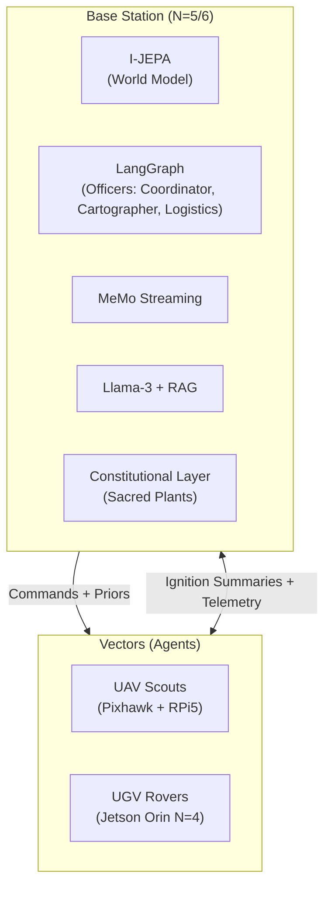
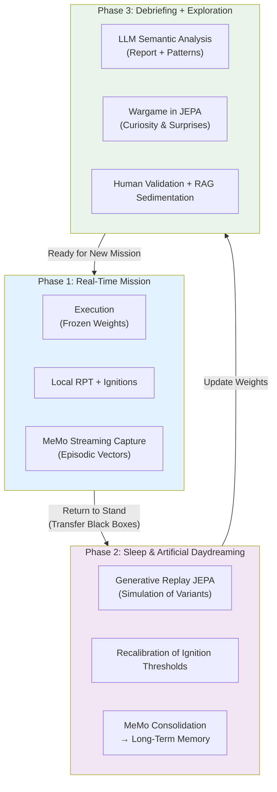

> ✨ Translated automatically with [**Do-My-Work**](https://github.com/AlainCo/do-my-work) — profile: technical.

# MVP Project Specifications: Operation GARRIGUE-X

To validate this architecture without the infrastructure costs of the aeronautics domain, we are deploying a 12-month project in a real and complex competitive environment: **the Mediterranean garrigue**.

## A. The "Game-World" and Rules

**The Terrain:** One hectare of rugged natural terrain (rocks, dense bushes, slope breaks).

**The Minerals:** Blocks of cellular concrete (Siporex) identified by hardened *ArUco* geometric markers.

**The Objective:** Two teams of robots compete to collect these blocks and stack them to build a continuous wall line protecting their base.

**The Sacred Prior (The Constitution):** At the center of the terrain are **Sacred Plants** (flower pots equipped with piezoelectric pressure sensors). Any damage inflicted on a plant results in the immediate elimination of the team.

**Why this framework is relevant:** It instantiates, on a human scale, the fundamental problems of real SoS — resource allocation under constraints, robustness to losses, distributed decision-making, and adherence to non-negotiable constitutional constraints. The plant is the poor man's law of armed conflict.

### B. Material and Technological Stack



#### 1. The Vectors (The Agents)

**Aerial (UAV — Scouts):** Light open-source quadcopters (Pixhawk controller + Raspberry Pi 5). Sensors: Standard camera + Optical flow. Role: Latent mapping, block spotting, sending topological summaries to HQ.

**Ground (UGV — Workers / Defenders):** All-terrain tracked RC rover chassis.

| Layer | Hardware | Architecture | Role |
|---|---|---|---|
| N=0/N=1 | Teensy 4.1 | PID + nano MLP | Motor torque management, slip adaptation |
| N=2/N=3 | Jetson Nano | Onboard Mamba (local RPT) | Dynamic prediction, obstacles, local SLAM |
| N=4 | Jetson Orin (Wi-Fi) | JEPA-S + mini workspace | Vector awareness, degraded state, workarounds |

**Actuators:** Servo gripper to grasp and move Siporex blocks. Each servo has its own nano MLP torque control model.

#### 2. The Base Station (Field HQ)

**Hardware:** Ruggedized computing station (desktop PC with dedicated GPU, powered by a generator).

**Software (N=5/N=6):**

| Component | Role in Architecture |
|---|---|
| I-JEPA (GPU) | Centralized world model, workspace N=5 |
| Modified [LangGraph](https://github.com/langchain-ai/langgraph) | Multi-agent framework, officer management |
| MeMo streaming | Terrain ignition capture and compression |
| Llama-3-8B (RAG) | N=6 interface, human operator dialogue |
| Constitutional layer | Hard constraint: plant ≠ touched, regardless of optimization |

**The "Officers" of the MVP:** Simplified version with 3 distinct roles and different salience profiles.

```
     [COORDINATOR (Captain)]
      ↑ summaries  ↓ priors
┌───────────┬───────────┐
│CARTOGRAPHER│LOGISTICIAN│
│(Science)  │(Engineer)  │
│Salient :  │Salient :   │
│anomalies  │resources   │
│topology   │failures    │
└───────────┴───────────┘
```

### C. The Learning Cycle in 3 Phases (The Triple Biological Loop)

The system follows a biology-inspired cycle: **awakening → sleep → debriefing**, which ensures both mission stability and continuous adaptation.



**Phase Details:**

**Phase 1 – Mission:** Neural weights are frozen to ensure stability and predictability. Only local RPT loops adapt in real-time. Each ignition is captured by MeMo with its context and salience score.

**Phase 2 – Sleep & Daydreaming:** This is the core of continuous learning. The JEPA model replays significant trajectories in its latent space (without material risk). It generates variants ("what if?"), recalibrates ignition thresholds, and consolidates important experiences into long-term memory via MeMo.

**Phase 3 – Debriefing + Play:** Semantic analysis by the LLM, pattern identification, and above all **exploration through curiosity** via self-generated wargames in the JEPA latent space. Promising tactics are validated by humans and then injected into the doctrinal RAG.

**Role of the Constitutional Layer:** At each phase (especially during daydreaming and consolidation), an independent and non-modifiable module checks that fundamental constraints (e.g., never harm sacred plants) remain intact.

This cycle transforms the system from a simple executor into an entity that **truly learns** from its experience while maintaining a stable identity and ethical robustness.

## 4. Call for Skills: Join the GARRIGUE-X Team

This project is not a classic software demonstration on a simulator. It's an adventure of raw engineering where code meets dust, the blinding sun of the garrigue, and unexpected hardware failures. We are looking for specialized profiles, ready to invest themselves to push the limits of distributed autonomous robotics:

**Automatic & Robotics Engineers (N=0/N=1/N=2):** Experts in control systems, Kalman filters, and real-time microkernels. You will design the survival reflexes of the rovers when the wheels slip on crumbly rock.

**Machine Learning Researchers (N=3/N=4/N=5):** Specialists in SSM architectures (Mamba, RWKV), intrinsic motivation-based Reinforcement Learning, JEPA architectures, and continuous episodic memory (MeMo). You will create the dream engine of our machines.

**Neuroscientists / Cognitive Psychologists:** To validate and refine the functional profiles of the modules, ignition thresholds, and computational modeling of personality traits. The RPT/GNWT boundary needs to be experimentally calibrated on our platform.

**Software Architects & LLM Ops (N=6):** Experts in distributed systems, multi-agent architectures, and RAG pipelines. You will build the Constitutional Layer — the cognitive immune system that will prevent our robots from crushing the sacred plant out of pure optimized curiosity.

**Ethicists and AI/defense specialized lawyers:** The Constitutional Layer is not a technical detail — it's the central problem. We need people capable of translating legal and ethical constraints into mathematical constraints on latent spaces. This is not an honorary position.

**The deliverable expected in 12 months is clear:** a pack of robots capable of adapting alone to the destruction of one of their members, of reconfiguring their behavior laws in a night of artificial dreaming, of winning the wargame against an opposing team — under the strategic control of a human operator, and without ever touching the plant.

All of this in the garrigue. Under the sun. Without air conditioning.

*Harry Tuttle, plumber.*

> ✨ Translated automatically with [**Do-My-Work**](https://github.com/AlainCo/do-my-work) — a tool designed to make projects speak globally.
