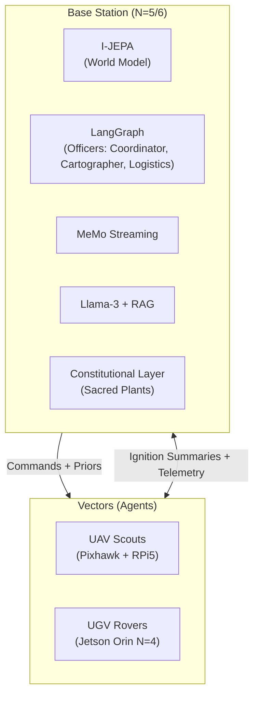
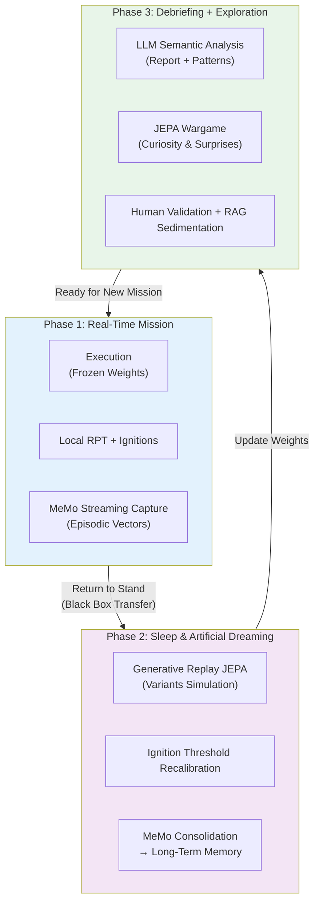

> ✨ Translated automatically with **Do-My-Work** — profile: technical.

# **MVP Project Specifications: Operation GARRIGUE-X**

To validate this architecture without the infrastructure costs of the aeronautical domain, we deploy a **12-month project** in a real and complex competitive universe: **the Mediterranean garrigue**.

## **A. The "Game World" and Rules**

**The Terrain:** One hectare of rugged natural terrain (rocks, dense shrubs, slope breaks).

**The Minerals:** Cellular concrete blocks (*Siporex*) identified by *ArUco* geometric markers, hardened.

**The Objective:** Two teams of robots compete to collect these blocks and stack them to build a continuous **wall-line** protecting their base.

**The Sacred Priority (The Constitution):** At the center of the terrain lie **Sacred Plants** (flowerpots equipped with piezoelectric pressure sensors). Any damage inflicted on a plant results in the **immediate elimination** of the team.

**Why this framework is relevant:** It instantiates, at human scale, the core challenges of real-world SoS—resource allocation under constraints, robustness to losses, distributed decision-making, and adherence to non-negotiable constitutional constraints. The sacred plant is the poor man’s law of armed conflict.

### B. Hardware and Tech Stack



#### 1. The Vectors (The Agents)

**Aerial (UAV — Scouts):** Lightweight open-source quadcopters (Pixhawk controller + Raspberry Pi 5). Sensors: Standard camera + optical flow. Role: Latent mapping, block detection, sending topological summaries to HQ.

**Ground (UGV — Workers / Defenders):** All-terrain tracked RC rover chassis.

| Layer | Hardware | Architecture | Role |
|---|---|---|---|
| N=0/N=1 | Teensy 4.1 | PID + nano MLP | Motor torque management, slip adaptation |
| N=2/N=3 | Jetson Nano | Embedded Mamba (local RPT) | Dynamic prediction, obstacle avoidance, local SLAM |
| N=4 | Jetson Orin (Wi-Fi) | JEPA-S + Mini Workspace | Vector awareness, degraded state, workarounds |

**Actuators:** Servo-controlled gripper for handling and moving Siporex blocks. Each servo has its own nano MLP torque control model.

#### 2. The Base Station (Ground HQ)

**Hardware:** Ruggedized compute station (dedicated GPU desktop PC, powered by a generator).

**Software (N=5/N=6):**

| Component          | Role in Architecture                                                                 |
|--------------------|--------------------------------------------------------------------------------------|
| I-JEPA (GPU)       | Centralized world model, N=5 workspace                                               |
| Modified [LangGraph](https://github.com/langchain-ai/langgraph) | Multi-agent framework, officer management                                          |
| MeMo streaming     | Capture and compression of field ignition events                                    |
| Llama-3-8B (RAG)   | N=6 interface, human operator dialogue                                               |
| Constitutional layer| Hard constraint: plant ≠ touched, regardless of optimization                          |

**The "Officers" of the MVP:** Simplified version with 3 distinct roles and varying salience profiles.

```
     [COORDINATOR (Captain)]
      ↑ summaries  ↓ priors
┌───────────┬───────────┐
│MAPMAKER   │LOGISTICS  │
│(Science)  │(Engineer) │
│Salient:   │Salient:   │
│anomalies  │resources  │
│topology   │failures   │
└───────────┴───────────┘

### C. The Three-Phase Learning Cycle (The Biological Triple Loop)

The system follows a biology-inspired cycle: **awakening → sleep → debriefing**, ensuring both mission stability and continuous adaptation.
```



**Phase Details:**

**Phase 1 – Mission:** Neural weights are frozen to ensure stability and predictability. Only local RPT loops adapt in real-time. Each ignition is captured by MeMo along with its context and salience score.

**Phase 2 – Sleep & Daydreaming:** This is the core of continuous learning. The JEPA model replays significant trajectories in its latent space (with no physical risk). It generates variants ("what if?"), recalibrates ignition thresholds, and consolidates key experiences into long-term memory via MeMo.

**Phase 3 – Debriefing + Play:** Semantic analysis by the LLM, pattern identification, and **exploration driven by curiosity** through self-generated wargames in the JEPA latent space. Promising tactics are validated by humans and then injected into the doctrinal RAG.

**Role of the Constitutional Layer:** At every phase (especially during daydreaming and consolidation), an independent, unmodifiable module ensures that fundamental constraints (e.g., never damaging sacred plants) remain intact.

This cycle transforms the system from a mere executor into an entity that **truly learns** from its experience while maintaining a stable identity and ethical robustness.

## 4. Call for Skills: Join the GARRIGUE-X Team

This project isn’t a classic software demo on a simulator. It’s a raw engineering adventure where code meets dust, the blinding sun of the garrigue, and unexpected hardware failures. We’re looking for sharp profiles, ready to dive in and push the boundaries of distributed autonomous robotics:

**Automation & Robotics Engineers (N=0/N=1/N=2):** Experts in control systems, Kalman filters, and real-time microkernels. You’ll design the survival reflexes of our rovers when wheels slip on crumbly rock.

**Machine Learning Researchers (N=3/N=4/N=5):** Specialists in SSM architectures (Mamba, RWKV), intrinsic motivation-based reinforcement learning, JEPA architectures, and continuous episodic memory (MeMo). You’ll build the dream engine of our machines.

**Neuroscientists / Cognitive Psychologists:** To validate and refine functional profiles of modules, ignition thresholds, and computational modeling of personality traits. The RPT/GNWT boundary needs experimental calibration on our platform.

**Software Architects & LLM Ops (N=6):** Experts in distributed systems, multi-agent architectures, and RAG pipelines. You will build the **Constitutional Layer**—the cognitive immune system that will prevent our robots from crushing the sacred plant out of pure optimized curiosity.

**AI/Defense Ethics & Legal Specialists:** The Constitutional Layer isn’t a technical detail—it’s the core challenge. We need people who can translate legal and ethical constraints into mathematical constraints on latent spaces. This isn’t a ceremonial role.

**The deliverable in 12 months is clear:** a pack of robots capable of self-adapting to the destruction of one of their members, reconfiguring their behavioral laws in a single night of artificial dreaming, winning a wargame against an opposing team—under human strategic control—and never touching the plant.

All of this in the garrigue. Under the sun. No air conditioning.

*Harry Tuttle, plumber.*

> ✨ Translated automatically with **Do-My-Work** — a tool designed to make projects speak globally.
