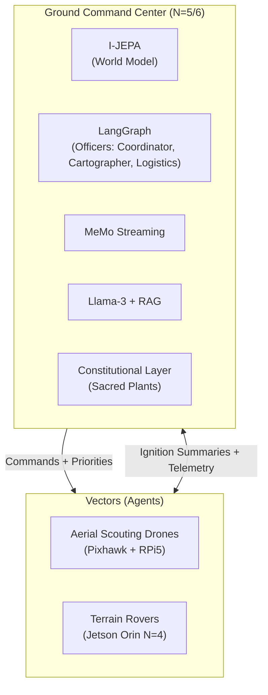
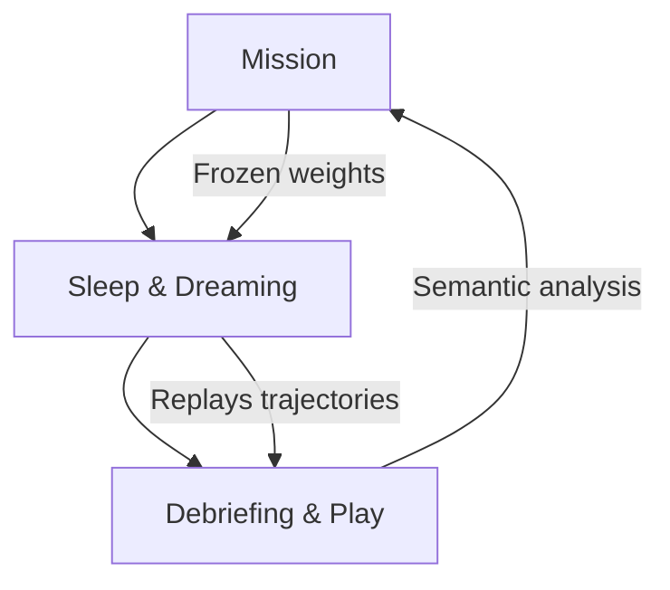
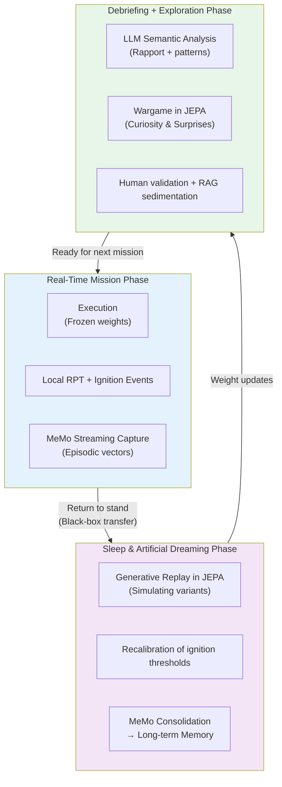

> ✨ Translated automatically with **Do-My-Work** — profile: technical.

# MVP Project Specifications: Operation GARRIGUE-X

To validate this architecture without the costs of aerospace infrastructure, we deploy a 12-month project in a real and complex competitive environment: **Mediterranean garrigue**.

## A. The "Game World" and Rules

**Terrain:** One hectare of rugged natural terrain (rocks, dense shrubs, slope breaks).

**Minerals:** Concrete cellular blocks (Siporex) marked with hardened *ArUco* geometric markers.

**Objective:** Two teams of robots compete to collect these blocks and stack them to build a continuous wall line protecting their base.

**The Sacred Priority (The Constitution):** At the center of the terrain are **Sacred Plants** (flower pots equipped with piezoelectric pressure sensors). Any damage to a plant results in the immediate elimination of the team.

**Why this framework is relevant:** It instantiates, at a human scale, the fundamental problems of real SoS systems—resource allocation under constraints, robustness to losses, distributed decision-making, and respect for non-negotiable constitutional constraints. The plant is the law of the poor’s armed conflicts.

### B. Equipment and Technological Stack



#### 1. Vectors (Agents)

**Aerial (UAV — Scouting):** Lightweight open-source quadcopters (Pixhawk controller + Raspberry Pi 5). Sensors: Standard camera + optical flow. Role: Latent cartography, block detection, and sending topological summaries to the QG.

**Terrestrial (UGV — Workers/Defenders):** Off-road RC rover chassis with caterpillar tracks.

```markdown
| Layer | Hardware | Architecture | Role |
|-------|----------|--------------|------|
| N=0/N=1 | Teensy 4.1 | PID + MLP nano | Motor torque control, slip adaptation |
| N=2/N=3 | Jetson Nano | Embedded Mamba (local RPT) | Dynamic prediction, obstacles, local SLAM |
| N=4 | Jetson Orin (Wi-Fi) | JEPA-S + mini workspace | Vector awareness, degraded state, workarounds |

**Actuators:** Servo gripper for Siporex blocks. Each servo has its own MLP nano torque control model.

---

**Ground Command Center (Field HQ):**

**Hardware:** Durable computing station (fixed PC with dedicated GPU, powered by generator).

**Software (N=5/N=6):**

| Component | Role in Architecture |
|-----------|-----------------------|
| I-JEPA (GPU) | Centralized world model, workspace N=5 |
| Modified [LangGraph](https://github.com/langchain-ai/langgraph) | Multi-agent framework, officer management |
| MeMo streaming | Capture and compression of field ignitions |
| Llama-3-8B (RAG) | N=6 interface, human operator dialogue |
| Constitutional layer | Hard constraint: plants must remain untouched |

**MVP Officers:** Simplified to 3 distinct roles with varying salience profiles.

```
     [COORDINATOR (Captain)]
      ↑ summaries ↓ priors
┌───────────┬───────────┐
│MAPPER     │LOGIST     │
│(Science)  │(Engineer) │
│Salience:  │Salience:  │
│anomalies  │resources  │
│topology   │failures   │
└───────────┴───────────┘
```

### **The 3-Phase Learning Cycle (Biological Triple Loop)**

The system follows a biology-inspired cycle: **awakening → sleep → debriefing**, ensuring both mission stability and continuous adaptation.

---


**Phase 1 – Mission:** Neural weights are frozen for stability. Only local RPT loops adapt in real-time. Each ignition is captured by MeMo with its salience context and score.

**Phase 2 – Sleep & Dreaming:** Core learning phase. JEPA replays significant trajectories in its latent space (no physical risk). It generates "what-if" variants, recalibrates ignition thresholds, and consolidates key experiences via MeMo.

**Phase 3 – Debriefing + Game:** Semantic analysis by LLM, pattern identification, and **curiosity-driven exploration** via auto-generated wargames in JEPA’s latent space. Promising tactics are validated by humans and injected into doctrinal RAG.

**Constitutional Layer Role:** Independently verifies constraints (e.g., never harm sacred plants) across all phases, especially during dreaming and consolidation.
```



**Phase 1 – Mission:** Frozen neural weights ensure stability and predictability. Only local RPT loops adapt in real-time. Each ignition event is captured by MeMo with its context and salience score.

---
**Detailed Phase Explanation:**

**Phase 1 – Mission:** Weights are frozen to guarantee stability and predictability. Only local RPT loops adapt in real-time. Every ignition event is captured by MeMo with its context and salience score.

**Phase 2 – Dreaming & Nighttime Learning:** The core of continuous learning. The JEPA model replays significant trajectories in its latent space (without physical risk). It generates variations ("what if?"), recalibrates ignition thresholds, and consolidates key experiences into long-term memory via MeMo.

**Phase 3 – Debriefing + Gameplay:** Semantic analysis by the LLM, pattern identification, and **curiosity-driven exploration** via auto-generated wargames in the JEPA latent space. Promising tactics are validated by humans and injected into doctrinal RAG.

**Role of the Constitutional Layer:** At every phase—especially during dreaming and consolidation—a non-modifiable module enforces fundamental constraints (e.g., never damaging sacred plants) across all stages.

This cycle transforms the system from a simple executor into an entity that **learns truly** from experience while maintaining a stable identity and ethical robustness.

---

## 4. Call for Skills: Join the GARRIGUE-X Team

This isn’t a typical software demo on a simulator—it’s a raw engineering adventure where code meets desert dust, blinding sun, and unexpected hardware failures. We’re looking for sharp profiles ready to push the boundaries of distributed autonomous robotics:

**Autonomous Systems & Robotics Engineers (N=0/N=1/N=2):** Experts in servo control, Kalman filters, and real-time micro-nodes. You’ll design the survival reflexes of rovers when wheels slip on loose rock.

**Machine Learning Researchers (N=3/N=4/N=5):** Specialists in SSM architectures (Mamba, RWKV), intrinsic-motivation-based reinforcement learning, JEPA frameworks, and continuous episodic memory (MeMo). You’ll build the dream engine of our machines.

**Neuroscience/Cognitive Psychologists:** To validate and refine functional profiles of modules, ignition thresholds, and computational modeling of personality traits. The RPT/GNWT frontier needs experimental calibration on our platform.

**Software Architects & LLM Ops (N=6):** Experts in distributed systems, multi-agent architectures, and RAG pipelines. You will design the **Constitutional Layer**—the cognitive immune system preventing robots from crushing sacred plants through pure curiosity-driven optimization.

**Ethicists & IA Defense Lawyers:** The Constitutional Layer isn’t a technical detail—it’s the core challenge. We need professionals to translate legal and ethical constraints into mathematical constraints over latent spaces. This isn’t a ceremonial role.

**Expected deliverable in 12 months:** a swarm of robots capable of self-adapting to the loss of a member, reconfiguring their behavioral laws overnight during artificial dream cycles, winning against adversarial teams in wargames—under human strategic oversight—and never touching the sacred plant.

All under the desert sun, no AC.

*Harry Tuttle, plumber.*

> ✨ Translated automatically with **Do-My-Work** — a tool designed to make projects speak globally.
