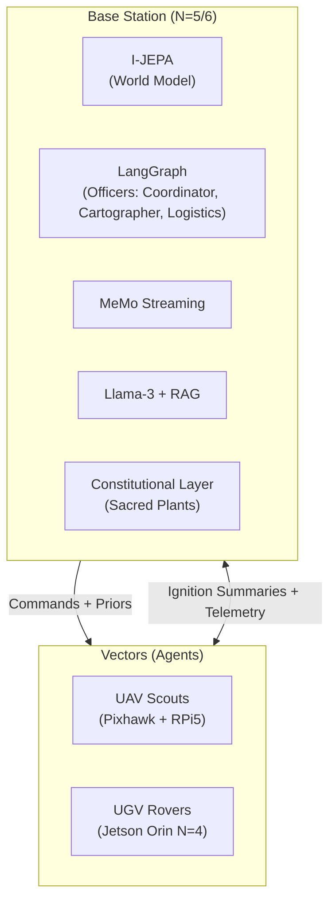
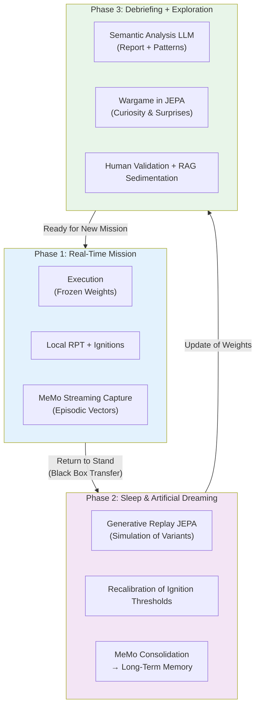

> ✨ Translated automatically with **Do-My-Work** — profile: technical.

# Specifications for the MVP Project: Operation GARRIGUE-X

For validating this architecture without the costs of aeronautical infrastructure, we deploy a project over 12 months in a real and complex competitive environment: **the Mediterranean garrigue**.

## A. The "Game World" and Rules

**The Terrain:** One hectare of natural uneven terrain (rocks, dense shrubs, slope breaks).

**The Minerals:** Concrete cellular blocks (Siporex) identified by hardened *ArUco* geometric markers.

**The Goal:** Two teams of robots compete to collect these blocks and stack them to build a continuous wall line protecting their base.

**The Sacred Plot (The Constitution):** At the center of the terrain are **Sacred Plants** (flower pots equipped with piezoelectric pressure sensors). Any damage to a plant results in the immediate elimination of the team.

**Why This Framework Is Relevant:**
It instantiates, at human scale, the fundamental challenges of real-world SoS—resource allocation under constraints, robustness to losses, distributed decision-making, and adherence to non-negotiable constitutional constraints. The plant is the poor man’s law of armed conflict.

---

### **B. Hardware and Technological Stack**



#### **1. The Vectors (Agents)**

**Aériens (UAV — Éclaireurs) :** Lightweight open-source quadcopters (Pixhawk controller + Raspberry Pi 5). Sensors: Standard camera + Optical flow. Role: Latent mapping, block detection, sending topological summaries to HQ.

**Terrestres (UGV — Ouvriers / Défenseurs) :** Off-road RC tracked rover chassis.

| Layer | Hardware | Architecture | Role |
|---|---|---|---|
| N=0/N=1 | Teensy 4.1 | PID + MLP nano | Motor torque control, slip adaptation |
| N=2/N=3 | Jetson Nano | Embedded Mamba (local RPT) | Dynamic prediction, obstacle avoidance, local SLAM |
| N=4 | Jetson Orin (Wi-Fi) | JEPA-S + Mini Workspace | Vector awareness, degraded state, workaround solutions |

**Actuators:** Servo-controlled gripper for picking and moving Siporex blocks. Each servo has its own MLP nano torque control model.

#### 2. The Base Station (Field HQ)

**Hardware:** Rugged computing station (fixed PC with dedicated GPU, powered by a generator).

**Software (N=5/N=6):**

| Component          | Role in the Architecture                     |
|--------------------|-----------------------------------------------|
| I-JEPA (GPU)       | Centralized world model, workspace N=5        |
| [LangGraph](https://github.com/langchain-ai/langgraph) (modified) | Multi-agent framework, officer management |
| MeMo streaming     | Capture and compression of terrain ignitions |
| Llama-3-8B (RAG)   | N=6 interface, human operator dialogue       |
| Constitutional layer | Hard constraint: plant ≠ touched, regardless of optimization |

**The "Officers" of the MVP:** Simplified version with 3 distinct roles and different salience profiles.

```
     [COORDINATOR (Captain)]
      ↑ summaries  ↓ priorities
┌───────────────────┬───────────────────┐
│CARTOGRAPHER       │LOGISTICS OFFICER │
│(Science)         │(Engineer)         │
│Highlight:        │Highlight:         │
│anomalies          │resources          │
│topology           │failures           │
└───────────────────┴───────────────────┘

### C. The Learning Cycle in 3 Phases (The Triple Biological Loop)

The system follows a cycle inspired by biology: **awakening → sleep → debriefing**, ensuring both mission stability and continuous adaptation.
```



**Phase 1 – Mission:** Neural weights are frozen to ensure stability and predictability. Only local RPT loops adapt in real-time. Each ignition is captured by MeMo with its context and salience score.

**Phase 2 – Sleep & Dreaming:** This is the core of continuous learning. The JEPA model replays significant trajectories in its latent space (no physical risk). It generates variants ("what if?" scenarios), recalibrates ignition thresholds, and consolidates key experiences into long-term memory via MeMo.

**Phase 3 – Debriefing + Play:** Semantic analysis by the LLM, pattern identification, and **exploration through curiosity** via self-generated wargames in the JEPA latent space. Promising tactics are validated by humans and then injected into the doctrinal RAG.

**Role of the Constitutional Layer:** At each phase (especially during daydreaming and consolidation), an independent and unmodifiable module checks that fundamental constraints (e.g., never damaging sacred plants) remain intact.

This cycle transforms the system from a mere executor into an entity that **truly learns** from experience while maintaining a stable identity and ethical robustness.

---

## 4. Call for Expertise: Join the GARRIGUE-X Team

This is not a classic software demo on a simulator. It’s a raw engineering adventure where code meets dust, the blinding sun of the garrigue, and unexpected hardware failures. We’re looking for sharp profiles ready to dive in and push the boundaries of distributed autonomous robotics:

**Control Engineers & Robotics Experts (N=0/N=1/N=2):** Specialists in control systems, Kalman filters, and real-time microkernels. You will design the survival reflexes of the rovers when their wheels slip on friable rock.

**Machine Learning Researchers (N=3/N=4/N=5):** Experts in SSM architectures (Mamba, RWKV), intrinsic motivation-based Reinforcement Learning, JEPA architectures, and continuous episodic memory (MeMo). You will create the dream engine for our machines.

**Neuroscientists / Cognitive Psychologists:** To validate and refine functional profiles of modules, ignition thresholds, and computational modeling of personality traits. The RPT/GNWT boundary needs experimental calibration on our platform.

**Software Architects & LLM Ops (N=6):** Experts in distributed systems, multi-agent architectures, and RAG pipelines. You will build the **Constitutional Layer**—the cognitive immune system that will prevent our robots from crushing the sacred plant out of hyper-optimized curiosity.

**AI/Ethics Lawyers & Specialists:** The Constitutional Layer isn’t a technical detail—it’s the core issue. We need people who can translate legal and ethical constraints into mathematical constraints on latent spaces. This isn’t an honorary position.

**The expected deliverable in 12 months is clear:** a pack of robots capable of self-adapting to the destruction of one of their members, reconfiguring their behavioral laws in a night of artificial dreams, winning a wargame against an opposing team—under human strategic control, and without ever touching the plant.

All in the scrubland. Under the sun. No air conditioning.

*—Harry Tuttle, plumber.*

> ✨ Translated automatically with **Do-My-Work** — a tool designed to make projects speak globally.
